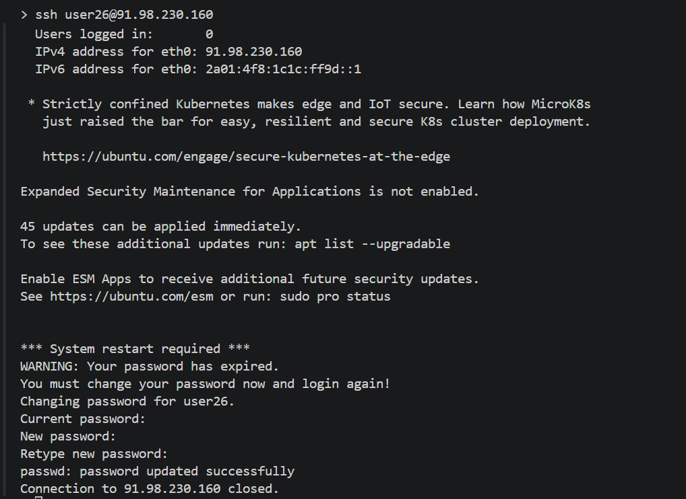
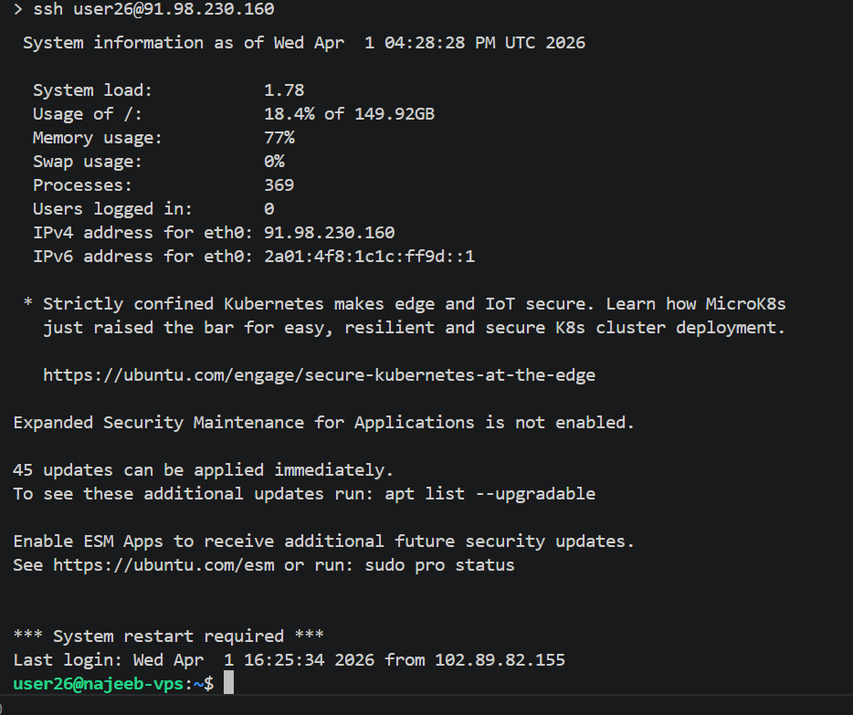
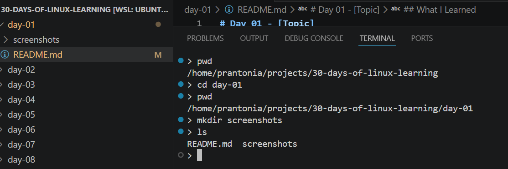
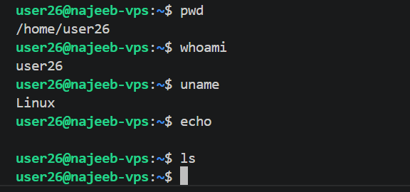

# Day 01 - Linux History, Distributions & Terminal Set UP

## Objective

To understand the origins of Linux, what makes it different from other operating systems, explore the major distributions available and why Linux is important for Data Engineering

---

## What I Learned

- Linux is an open-source, Unix-like operating system kernel created by Linus Torvalds in 1991
- The difference between a kernel, shell, and desktop environment	
- Popular Linux distributions: Ubuntu, Debian, Fedora, Arch, CentOS/RHEL, Kali Linux
- Why Linux is widely used in servers, cloud infrastructure, Data Engineering and DevOps
- Key Linux characteristics: multi-user, multitasking, open-source, secure
- Basic commands: pwd, whoami, uname, clear, echo.

---

## What I Built / Practiced

- I was able to set up my Linux VM provided by the DEC team
- Successfully logged into a VM terminal for the first time
- Created day-01/screenshots folder using the terminal instead of clicking

---

## Challenges Faced

- Understanding the difference between a distribution and the Linux kernel
- VM setup issues or terminal not launching as expected

---

## Key Takeaways

- Linux powers over 90% of the world's servers and cloud infrastructure
- Linux skill starts with terminal comfort, not memorizing everything at once.

---

## Resources

- Book: The Linux Command Line by William Shotts free at [www.linuxcommand.org](https://linuxcommand.org)
- Video: Linux in 100 Seconds — [Fireship on YouTube](https://www.youtube.com/watch?v=rrB13utjYV4)
- Article: What is Linux? — Red Hat (https://www.redhat.com/en/topics/linux/what-is-linux)
- Course: Introduction to Linux — [The Linux Foundation](https://training.linuxfoundation.org/training/introduction-to-linux/)

---

## Output

*Figure 1: DEC VM Password Setup*

---

*Figure 2: DEC VM Terminal Access*

---

*Figure 3: Screenshots Folder Creation*

---

*Figure 4: Basic Commands*

---
