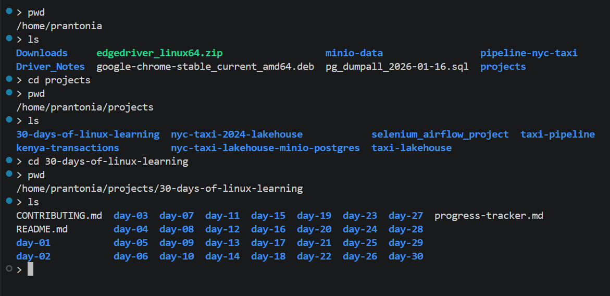
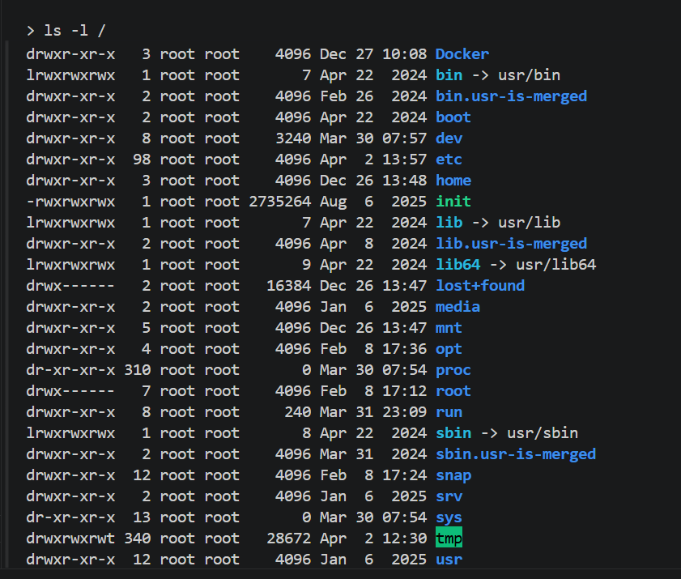
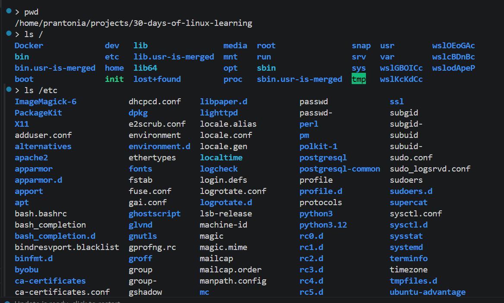
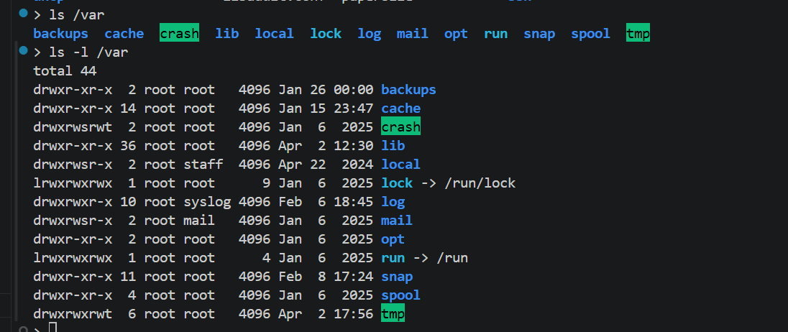
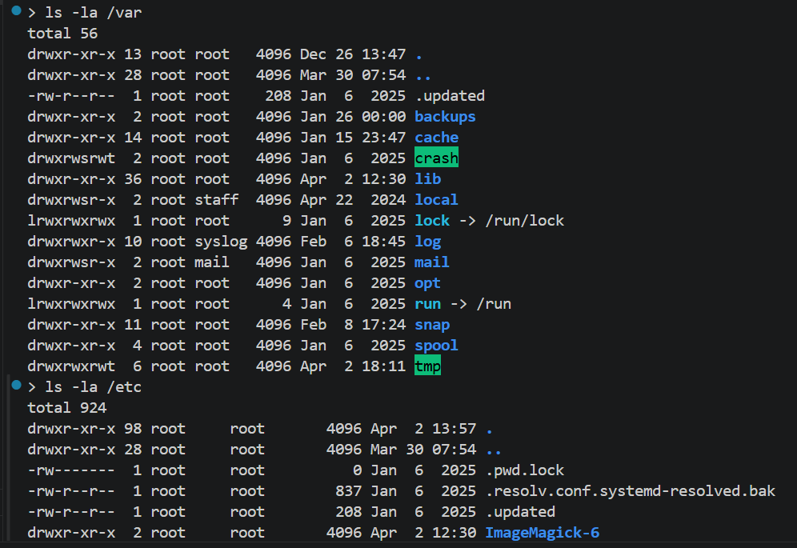

# Day 02 - Navigating the File System

## Objective

To learn how the Linux file system is structured and practice navigating directories using the command line.

---

## What I Learned

- The Linux file system hierarchy: / (root), /home, /etc, /var, /usr, /bin, /tmp, /dev
- Commands: pwd (print working directory), ls (list), cd (change directory)
- Absolute vs relative paths — e.g. /home/user/docs vs ../docs
- Hidden files and directories start with a dot (.) — use ls -a to see them
- The ~ symbol represents the current user's home directory

- Meaning of /, /home, /etc, /var, /tmp, and /usr.
- Navigation commands: ls, cd, pwd, ls -la.
- Difference between absolute and relative paths. 

---

## What I Built / Practiced

- Navigated from / to /home to /etc and back using only the terminal
- Listed contents of /etc and /var with different ls flags (ls -l, ls -lh, ls -la)
- Used pwd at each level to verify my position in the file system

---

## Challenges Faced

- Getting lost in the file system.
- Mixing up relative paths and absolute paths.

---

## Key Takeaways

- Understanding paths is essential for every Linux and data engineering workflow.
- Everything in Linux is a file, even hardware devices are represented as files in /dev
- Mastering cd, ls, and pwd is the foundation of all Linux work

---

## Resources

- Book: The Linux Command Line - Chapter 3: Exploring the System [www.linuxcommand.org](https://linuxcommand.org)
- Video: Linux File System Explained - [Akamai Dveloper on YouTube](https://www.youtube.com/watch?v=P0QZnAnsQ4c)
- Interactive: [Linux Survival](https://linuxsurvival.com) — online practice terminal
- Linux File Hierarchy Structure - [GeeksforGeeks](https://www.geeksforgeeks.org/linux-unix/linux-file-hierarchy-structure/)
- Linux Journey [File System Navigation](https://linuxjourney.org/tutorials/file-system-navigation)
- FreeCodeCamp [Linux Command Handbook](https://www.freecodecamp.org/news/the-linux-commands)

---

## Output

*Figure 1: Folder Navigation*

---

*Figure 2: Root File System*

---

*Figure 3: Basic Command ls /etc*

---

*Figure 4: Basic Command ls /var*

---

*Figure 5: Basic Command ls -la /var*

---
