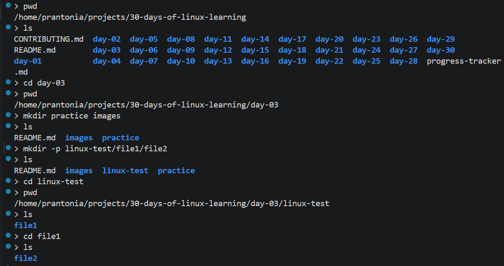
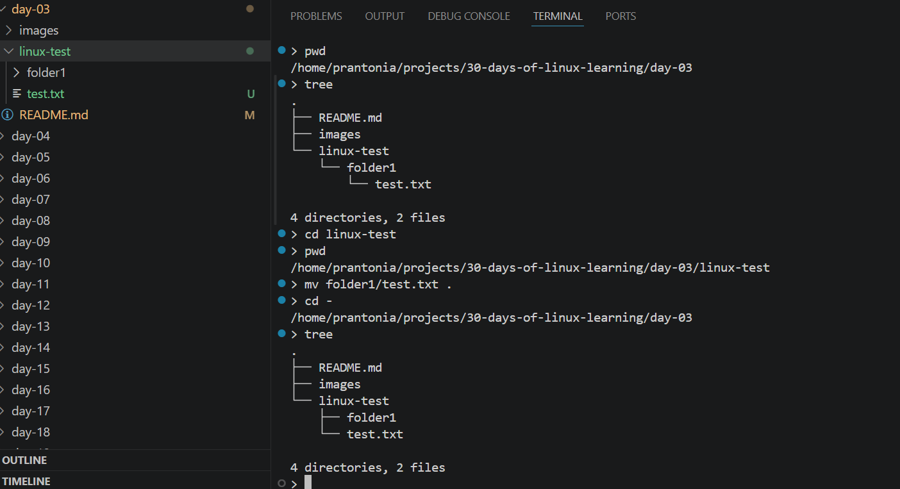
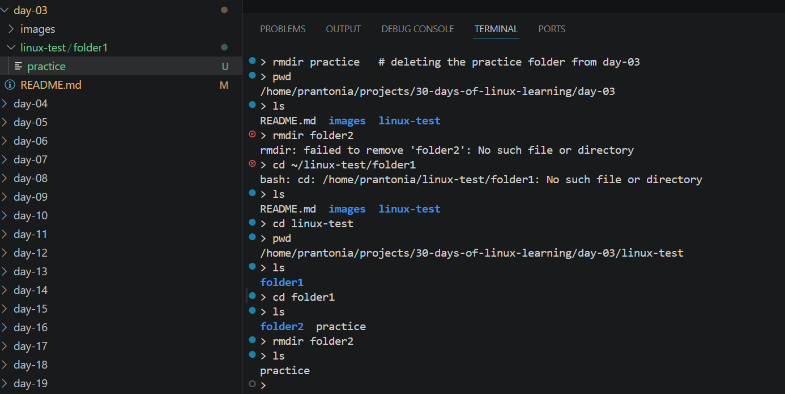

# Day 03 - File and Directory Management

## Objective

 To be comfortable creating, renaming, copying, moving, and deleting files and folders.

---

## What I Learned

- mkdir: create new directories; mkdir -p creates nested directories
- cp: copy files, cp source dest; cp -r for directories
- mv: move or rename files and directories
- rm: remove files; rm -r for directories; rm -rf (use with caution)
- The importance of being careful with rm, there is no recycle bin in Linux

---

## What I Built / Practiced

- Created directory structures
- Practiced copying files, renaming them, and removing test files

---

## Challenges Faced

- Using the wrong path when copying or moving files.

---

## Key Takeaways

- Linux commands become easier when folder structure is intentional.
- Always double-check before using rm -rf, it permanently deletes without confirmation
- mkdir -p is very useful for creating multi-level directory trees in one command

---

## Resources

- Book: The Linux Command Line, Chapter 4: Manipulating Files and Directories - [www.linuxcommand.org](https://www.linuxcommand.org/tlcl.php)

---

## Output

*Figure 1: Creating Folders*

---

*Figure 2: Moving a file*

---

*Figure 3: Deleting a directory*

---
