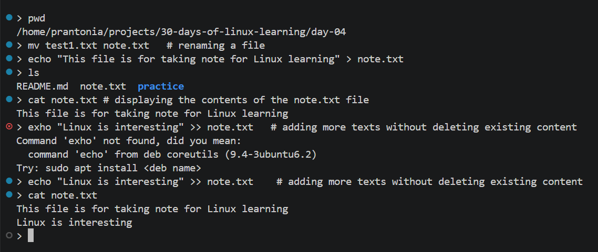
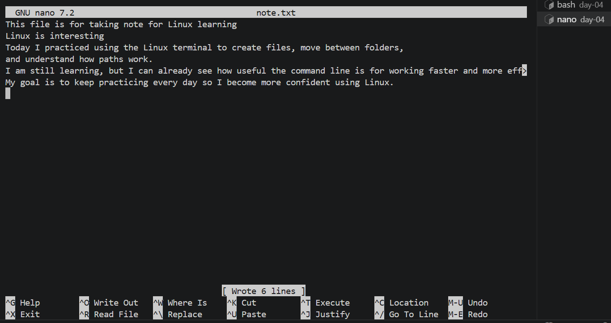
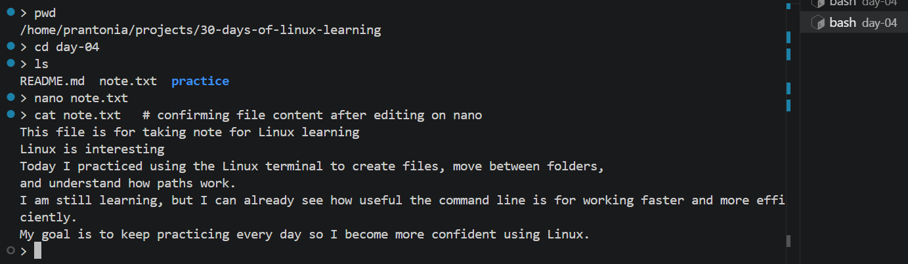
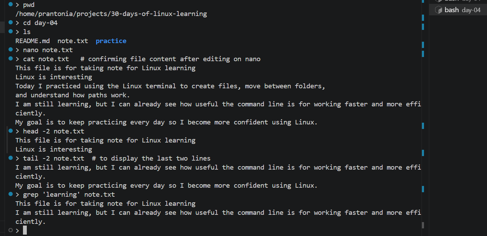
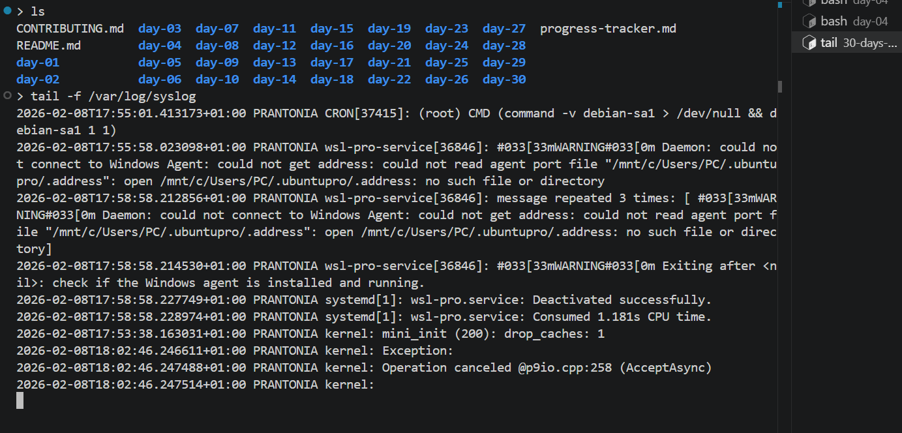

# Day 04 - Viewing and Editing Files

## Objective

To read, display, and edit text files using various command-line tools.

---

## What I Learned

- cat: display file contents; cat -n shows line numbers
- head and tail: view first/last N lines; tail -f follows a file in real time
- nano: beginner-friendly text editor, simple and menu-driven
- grep: search text inside files - grep 'learning' filename

---

## What I Built / Practiced

- Viewed /etc/passwd and /etc/hosts using cat, less, and head
- Created a note.txt file on the terminal, edited it in nano, saved and closed
- Used tail -f on a log file (e.g. /var/log/syslog) to watch it update

---

## Challenges Faced

- Understanding the difference between cat, more, less, and when to use each

---

## Key Takeaways

- head, tail, and less are small commands with huge daily value.
- nano is great for quick edits.
- Using -v prevents editing in nano - (nano -v note.txt)

---

## Resources

- Nano Text Editor in Linux - [GeeksforGeeks](https://www.geeksforgeeks.org/linux-unix/nano-text-editor-in-linux/)
- [Nano Cheatsheet:](https://www.nano-editor.org/dist/latest/cheatsheet.html)

---

## Output

*Figure 1: Creating a File via Terminal*

---

*Figure 2: Editing a File in Nano*

---

*Figure 3: Using cat to confirm edit*

---

*Figure 4: Using head, tail and grep*

---

*Figure 5: Using tail -f*

--- 
