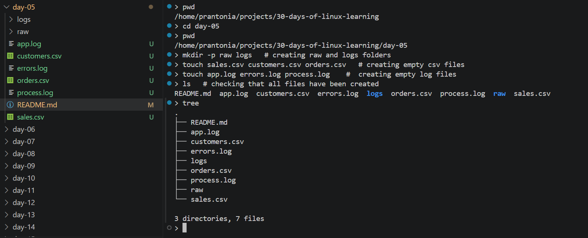
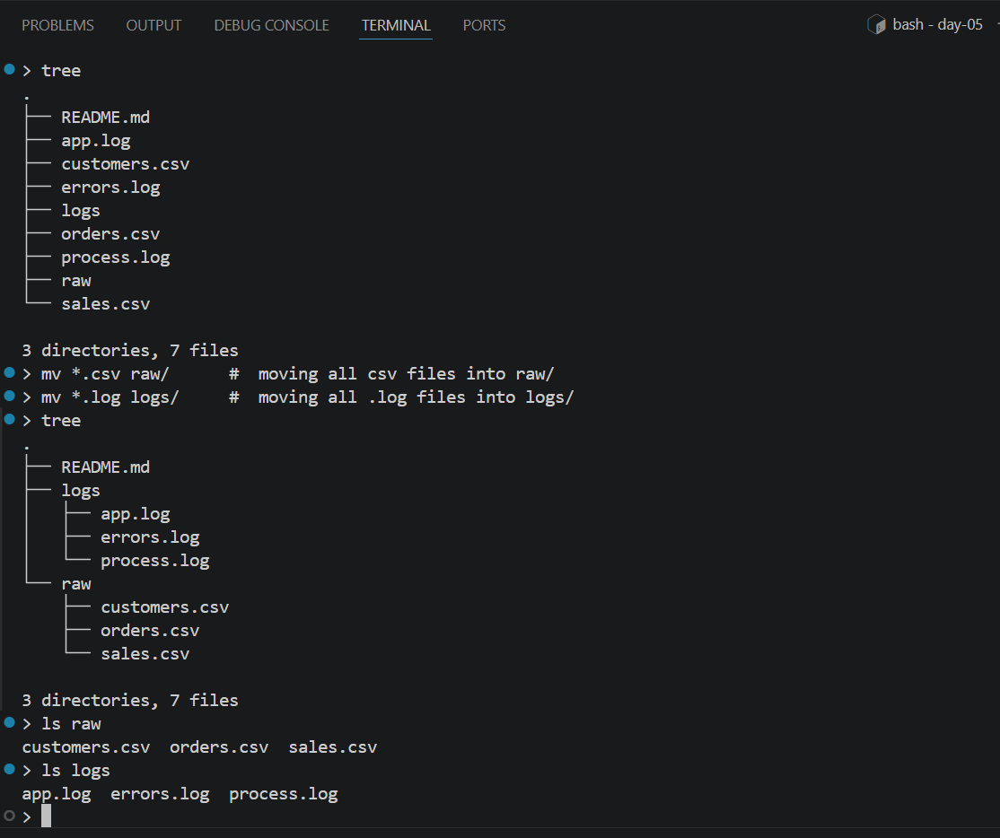
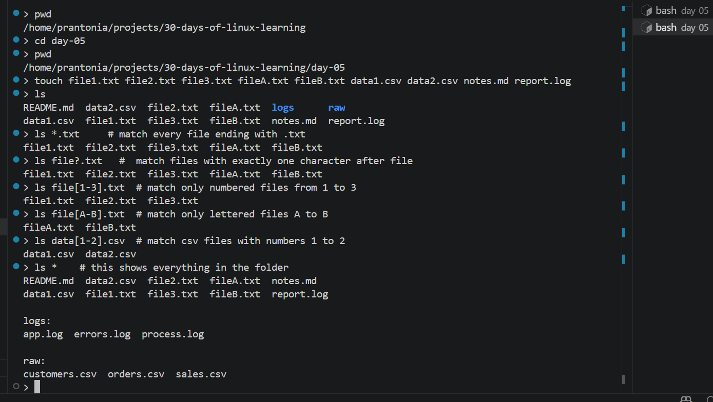

# Day 05 - Wildcards, Globbing, and Bulk File Operations

## Objective

To use pattern matching to work with multiple files at once.

---

## What I Learned

- Wildcards: *, ?, and character ranges.
- How to list, copy, or move groups of files using patterns.
- Why careful previews matter before destructive commands.

---

## What I Built / Practiced

- Create multiple sample CSVs and log files.
- Move all CSV files into raw/ and all .log files into logs/.
- Test commands safely with ls before using mv or rm.

---

## Challenges Faced

- Patterns matching more files than expected.
- Deleting or moving the wrong set of files.

---

## Key Takeaways

- Bulk file operations save time but require precision.
- Preview-first is a professional habit.

---

## Resources

- [The Linux Command Line](https://linuxcommand.org/tlcl.php)
- [freeCodeCamp Linux Command Handbook](https://www.freecodecamp.org/news/the-linux-commands/)

---

## Output

*Figure 1: Creating Folders*

---

*Figure 2: Using Wildcard*

---

*Figure 3: Using Globbing and Character ranges*

---
