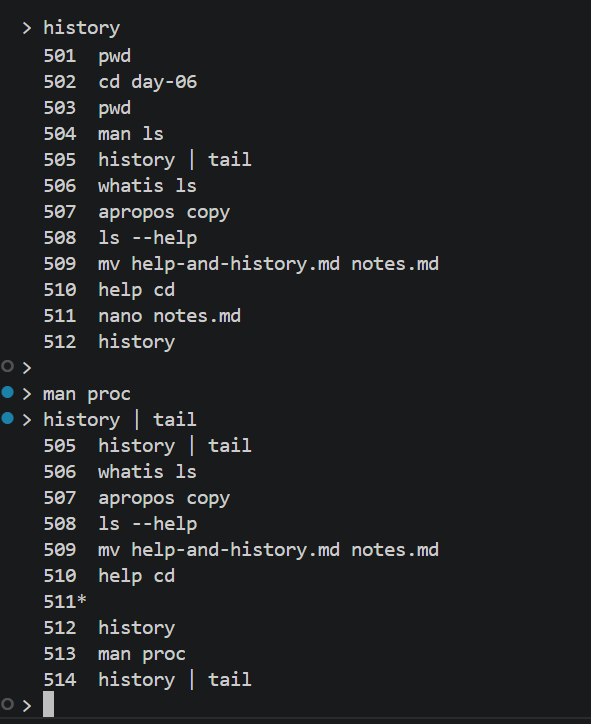
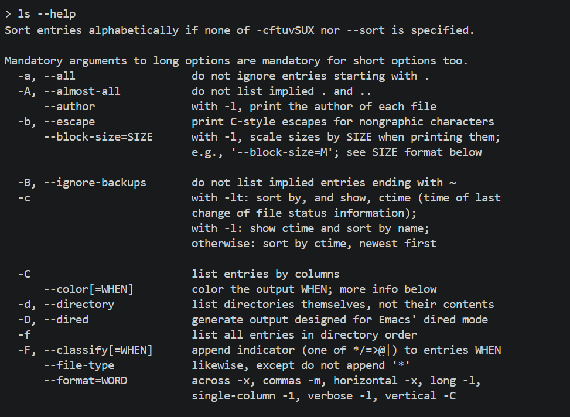
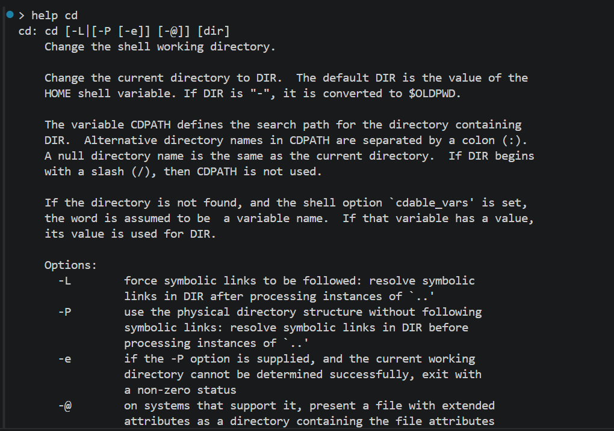
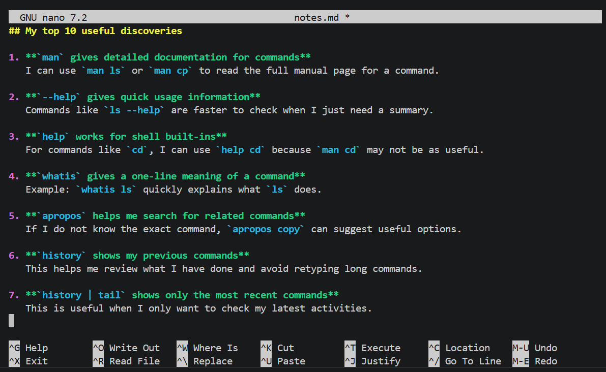

# Day 06 - Use Help Systems, Command History, and Shortcuts

## Objective

To learn how to find help directly from the Linux terminal, reuse previously typed commands, and use keyboard shortcuts to work faster and more efficiently.

---

## What I Learned

- Linux provides built-in help systems such as man, --help, info, whatis, and apropos
- The history command shows previously used commands, which makes it easier to repeat or review past work
- Terminal shortcuts such as Ctrl + A, Ctrl + E, Ctrl + R, and Tab improve speed and reduce the need to retype commands

---

## What I Built / Practiced

- Opened manual pages with commands like man ls and man cp
- Used ls --help, cp --help, whatis ls, and apropos copy to explore different help systems
- Ran history and history | tail to view recent commands
- Practiced shortcuts such as Ctrl + A, Ctrl + E, Ctrl + U, Ctrl + K, Ctrl + W, Ctrl + L, and Ctrl + R

---

## Challenges Faced

- Manual pages were detailed and a bit overwhelming at first
- Remembering the keyboard shortcuts took some practice
- Some help outputs looked similar, so I had to understand when each one is most useful

---

## Key Takeaways

- I do not need to memorize every Linux command because help is always available from the terminal
- Command history is useful for repeating commands quickly and reviewing earlier work
- Keyboard shortcuts make terminal usage faster and more efficient
- These skills are important because they will help me work better in Linux as I continue learning

---

## Resources

- [The Missing Semester](https://missing.csail.mit.edu/)
- [The Linux Command Line](https://linuxcommand.org/tlcl.php)

---

## Output

*Figure 1: Uisng history*

---

*Figure 2: Using ls --help*

---

*Figure 3: Using help cd*

---

*Figure 4: Learning notes created in nano*

---
