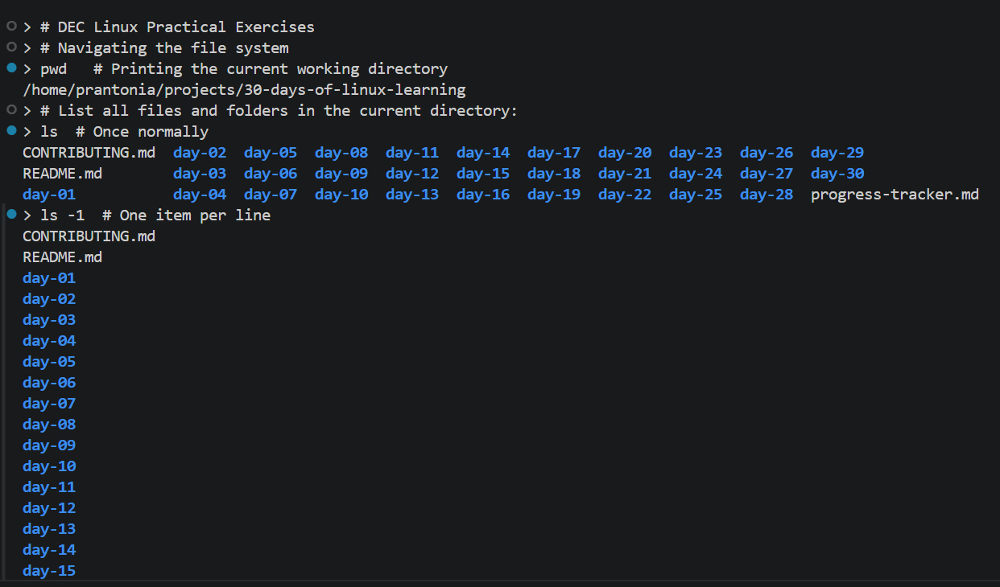
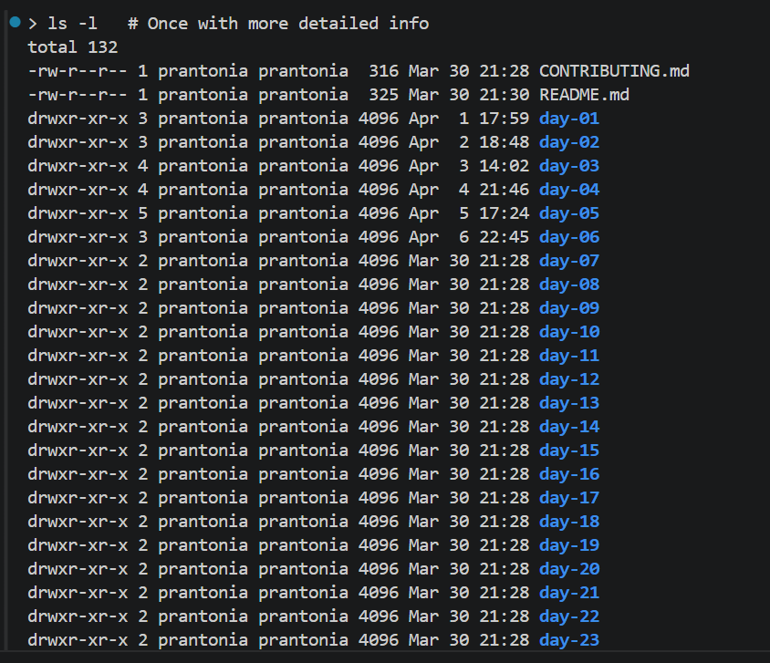
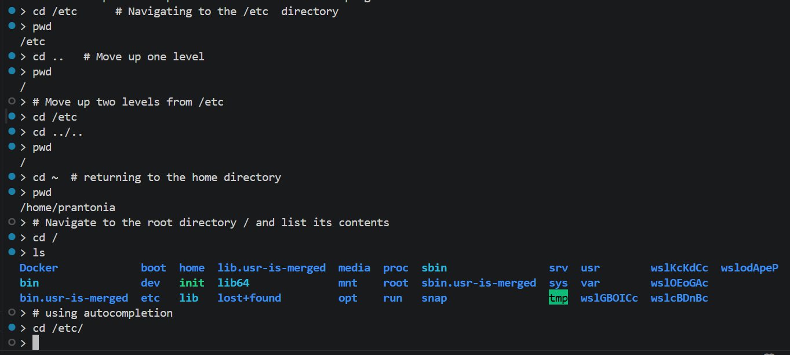
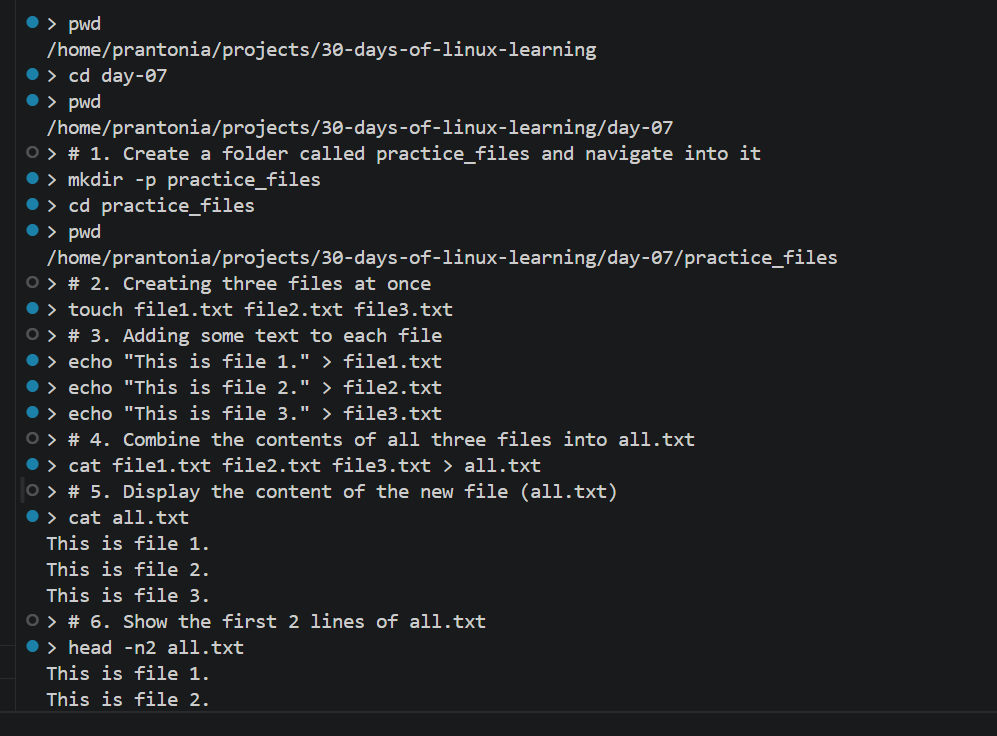
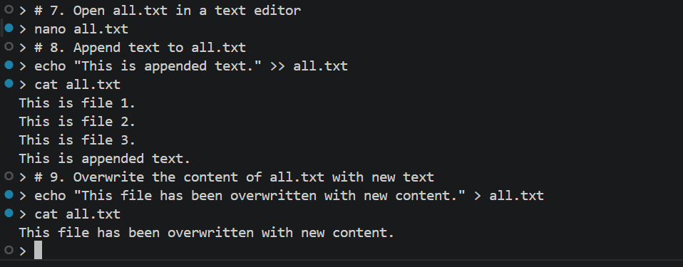
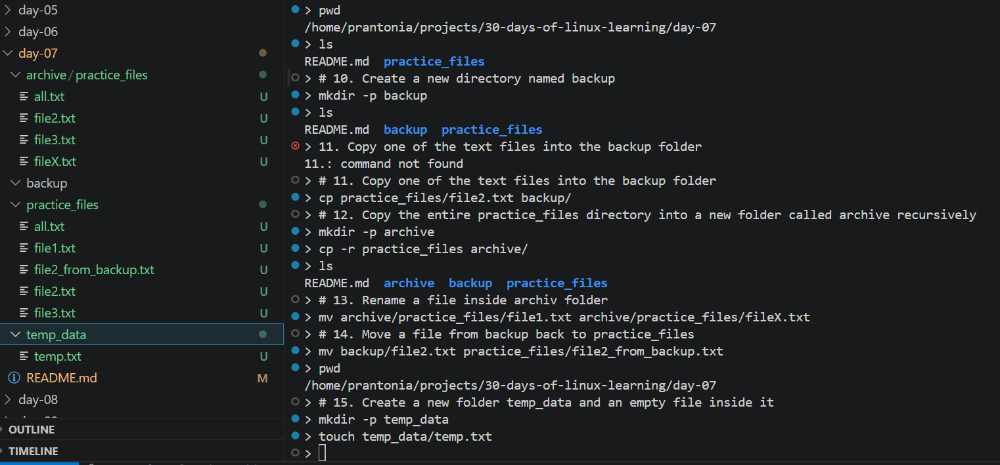
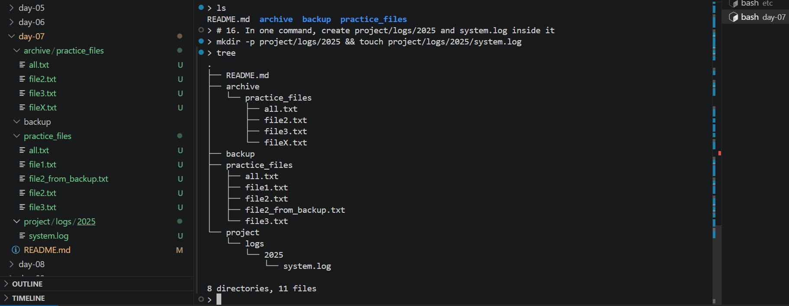
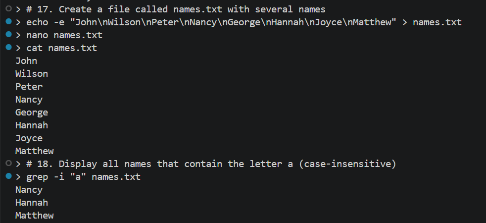

# Day 07 - Redirection and Pipes

## Objective

To learn how to use redirection and pipes in Linux to control command output, combine file contents, append or overwrite text in files, and connect commands together for faster text processing and file management.

---

## What I Learned

- `>` redirects output into a file and overwrites existing content
- `>>` appends output to the end of a file without removing what is already there
- `|` passes the output of one command into another command

- Commands like `cat`, `head`, `grep`, `sort`, and `uniq` become more powerful when combined with pipes
- Redirection and pipes are useful for handling text files, logs, and simple data-processing tasks

---

## What I Built / Practiced

- Created a practice_files directory and added multiple sample files
- Added text to files using redirection
- Combined the contents of several files into a new file called all.txt
- Displayed file contents and viewed only the first few lines of a file
- Opened files in a text editor and practiced appending and overwriting content
- Created sample CSV and log files, then organized them into raw/ and logs/
- Created a names.txt file and used `grep`, `sort`, `uniq`, and `head` to search, filter, and clean the data
- Practiced chaining commands together with pipes for more efficient output handling

---

## Challenges Faced

- I had to be careful not to confuse `>` with `>>`
- It took some practice to understand when to use a pipe instead of saving output directly to a file
- Some commands looked simple on their own, but combining them required more attention

---

## Key Takeaways

- `>` is best when I want to create a file or replace its content completely
- `>>` is best when I want to keep existing content and add more to it
- `<` is best when I want a command to read input from a file instead of typing it manually.
- `|` is best when I want to pass the output of one command directly into another command.
- Pipes make Linux commands more efficient because they let me chain tasks together
- Redirection and pipes are practical skills for handling logs, text files, and data workflows in Linux

---

## Resources

- [The Missing Semester shell lecture](https://missing.csail.mit.edu/2020/course-shell/)
- [GNU Bash Manual](https://www.gnu.org/software/bash/manual/bash.pdf)
- [freeCodeCamp Linux Command Handbook](https://www.freecodecamp.org/news/the-linux-commands-handbook/)

---

## Output

*Figure 1: Exercise 1*

---

*Figure 2: Exercise 2*

---

*Figure 3: Exercise 3*

---

*Figure 4: Exercise 4*

---

*Figure 5: Exercise 5*

---

*Figure 6: Exercise 6*

---

*Figure 7: Exercise 7*

---

*Figure 8: Exercise 8*

---
