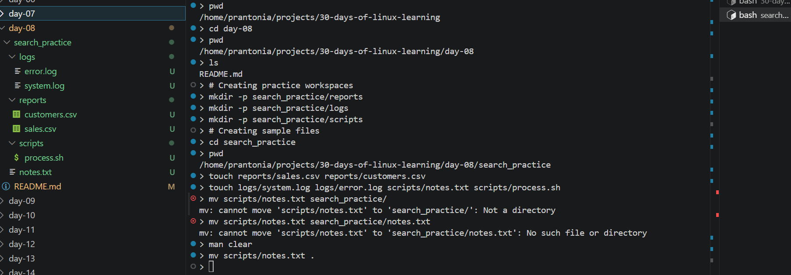
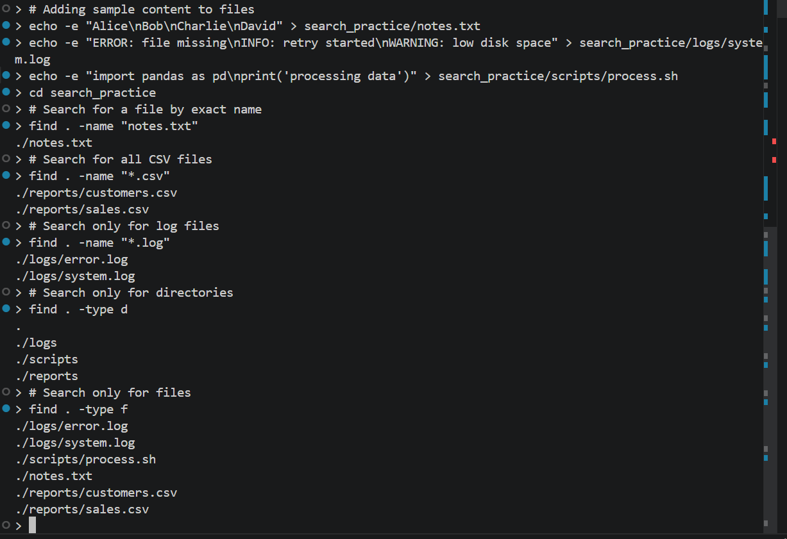
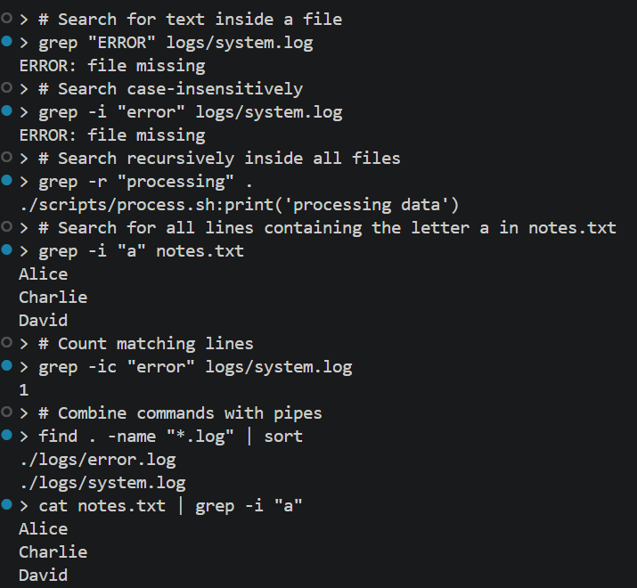

# Day 08 - Search for Files and Content

## Objective

To learn how to search for files and folders in Linux, and how to search inside files for specific words, patterns, or lines of text.

---

## What I Learned

- find is used to search for files and directories by name, type, or location
- locate can search for files quickly if its database is available and updated
- grep is used to search for text or patterns inside files
- grep -i makes the search case-insensitive
- grep -r can search through files inside directories recursively
- Combining search commands with pipes makes it easier to narrow down results

---

## What I Built / Practiced

- Created sample folders and files to practice searching
- Used find to search for files by name and extension
- Used find to search only for directories or only for files
- Used grep to search for specific words inside files
- Practiced case-insensitive searches with grep -i
- Used recursive search with grep -r
- Combined commands with pipes to filter file and content search results

---

## Challenges Faced

- I had to understand the difference between searching for a file and searching inside a file
- It took some practice to remember when to use find and when to use grep
- Recursive searches returned many results, so I had to read the output carefully
- Some commands looked similar, but their purpose was different

---

## Key Takeaways

- find helps me locate files and directories in the filesystem
- grep helps me locate text inside files
- Case-insensitive and recursive searches are very useful when working with many files
- Search commands are important because they save time when looking for files, logs, scripts, and specific content

---

## Resources

- [GNU Grep Manual](https://www.gnu.org/software/grep/manual/)
- [GNU Coreutils Manual](https://www.gnu.org/software/coreutils/manual/)

---

## Output

*Figure 1: Practice  1*

---

*Figure 2: Practice 2*

---

*Figure 3: Practice 3*

---
