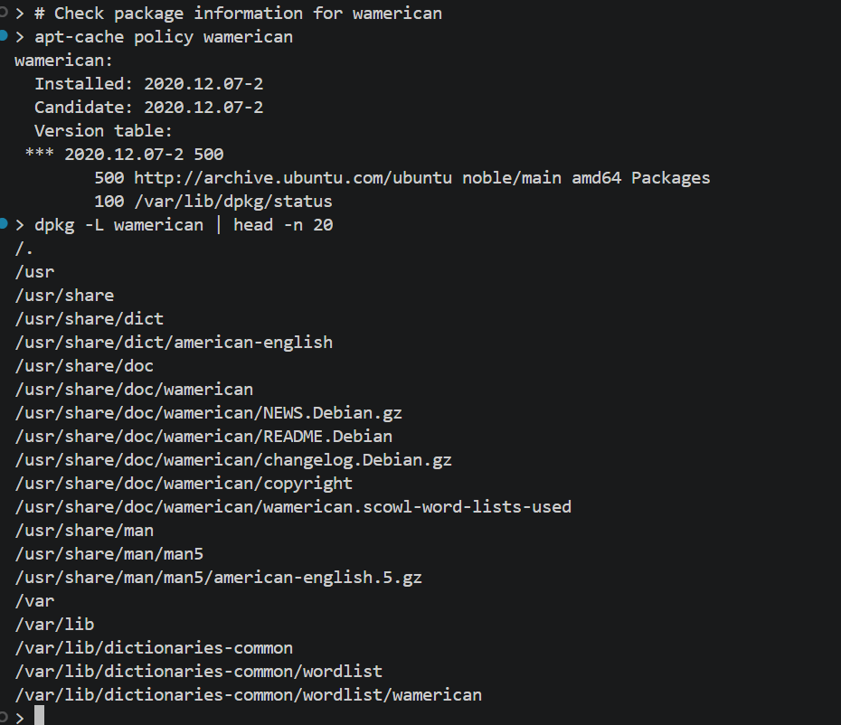
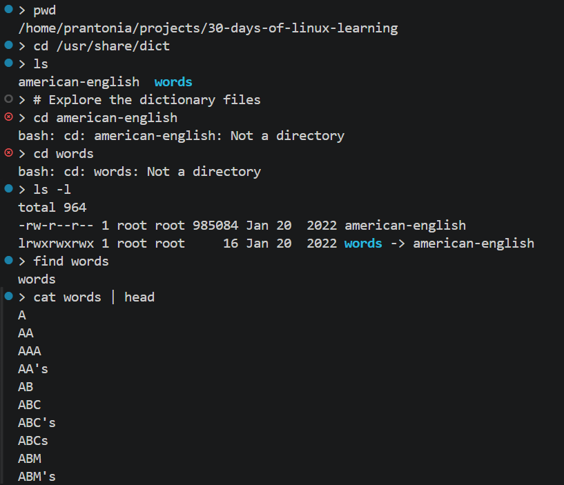

# Day 09 - Package Management

## Objective

To understand how software is installed, updated, searched for, and removed in Ubuntu Linux. Since I am using WSL Ubuntu, I also wanted to understand how package management behaves in that environment, especially when working with both `apt` and `snap`, and I wanted to practice by installing a real package like the wamerican dictionary.

---

## What I Learned

- Ubuntu uses `apt` as the main package manager for installing, updating, upgrading, and removing Debian packages.
- The usual package management flow is to run `sudo apt update` first, then install or upgrade packages as needed.
- `apt install`, `apt remove`, and `apt autoremove` are important commands for managing software and cleaning up unused dependencies.
- Ubuntu also supports `snap`, but in my WSL setup, `snap` did not work at first because systemd was not enabled.
- After enabling systemd in `/etc/wsl.conf` and restarting WSL, Snap started working correctly in my Ubuntu environment.
- Installing the `wamerican` package gave me access to a dictionary word list, which I could use from the terminal for practice in Linux.

---

## What I Built / Practiced

- Refreshed the package list with `sudo apt update`
- Searched for packages before installing them
- Installed and checked packages with `apt`
- Verified package versions using `apt-cache policy`
- Practiced removing packages and cleaning unused dependencies
- Troubleshot why `snap list` was failing in WSL
- Enabled `systemd` in WSL so that `snap` could work
- Successfully ran `snap list` after fixing the WSL setup
- Installed the `wamerican` dictionary package and explored the files it added
- Practiced checking the dictionary location in `/usr/share/dict`

---

## Challenges Faced

- I initially saw an error when using snap list because `snap` could not communicate with snapd
- I discovered that my WSL Ubuntu instance had not been booted with `systemd`, which prevented `snap` from working
- It took some troubleshooting to understand the difference between having the snap command installed and having the `snap` service actually running
- I also had to understand where the `wamerican` dictionary files were stored after installation

---

## Key Takeaways

- `apt` is the most important package manager for everyday Ubuntu use and is the main package system I should be comfortable with first.
- `snap` can also be useful in Ubuntu, but in WSL it may require extra setup because systemd must be enabled.
- Package management is not just about installing software; it also includes searching, verifying, updating, troubleshooting, and removing packages cleanly
- Installing `wamerican` showed me that package management can also add useful system resources, not just apps

---

## Resources

- [Ubuntu package management documentation](https://ubuntu.com/server/docs/how-to/software/package-management/)
- [Microsoft WSL systemd documentation](https://learn.microsoft.com/en-us/windows/wsl/systemd)
- [Using apt Commands in Linux](https://itsfoss.com/apt-command-guide/)

---

## Output

*Figure 1: Practice 1*

---

*Figure 2: Practice 2*

---
