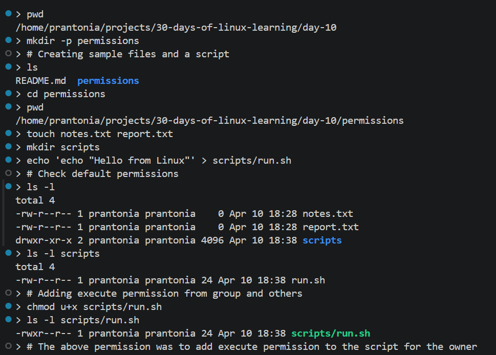
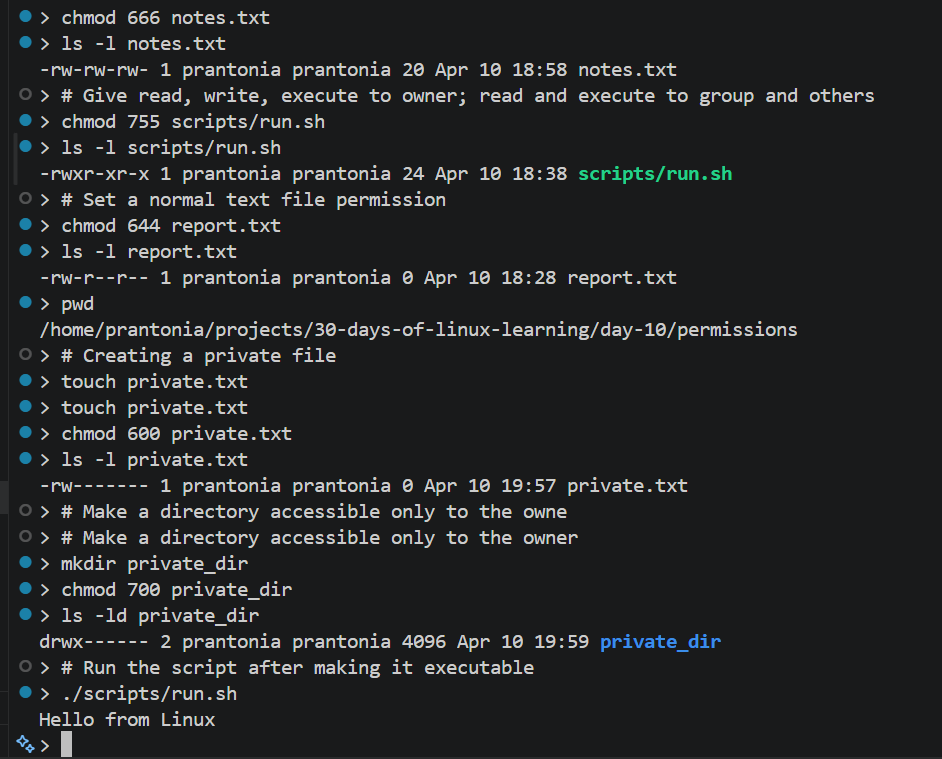

# Day 10 - Understanding File Permissions

## Objective

To understand how file permissions work in Linux, how to read permission strings, and how to control who can read, write, or execute files and directories.

---

## What I Learned

- Every file and directory in Linux has permissions that control access
- Permissions are grouped into three categories: user (owner), group, and others
- The main permission types are:
    `r` = read
    `w` = write
    `x` = execute
- `ls -l` shows permissions in symbolic form, such as `-rw-r--r--`
- `chmod` is used to change permissions
- `chown` is used to change file ownership
- Directories use permissions differently from files, especially with x for access/traversal

---

## What I Built / Practiced

- Listed files with `ls -l` to inspect permission settings
- Created sample files and directories to test permission changes
- Used `chmod` with symbolic mode like `u+x` and `go-w`
- Used `chmod` with numeric mode like 755 and 644
- Compared permissions for files versus directories
- Practiced making a script executable before running it

---

## Challenges Faced

- Understanding octal notation, onverting between symbolic and octal
- Permission denied errors when trying to run scripts without execute bit

---

## Key Takeaways

- Linux permissions are an important security feature
- `ls -l` helps me quickly inspect access levels on files and directories
- `chmod` is essential for controlling access and making scripts executable
- Directories behave differently from files, so permissions must be interpreted carefully
- `644` for files (owner read/write, others read-only) and `755` for executables/directories are the most common permission sets
- Never use `chmod 777` on production files, it grants everyone full access
- Permissions are a security and reliability topic, not just a syntax topic.
- Scripts need execute permission to run cleanly.

---

## Resources

- [The Linux Command Line - Chapter 9: Permissions]((https://linuxcommand.org/tlcl.php))
- [An Introduction to Linux Permissions - DigitalOcean](https://www.digitalocean.com/community/tutorials/an-introduction-to-linux-permissions)
- [chmod calculator](https://chmod-calculator.com)

---

## Output

*Figure 1: Practice 1*

---

*Figure 2: Practice 2*

---
