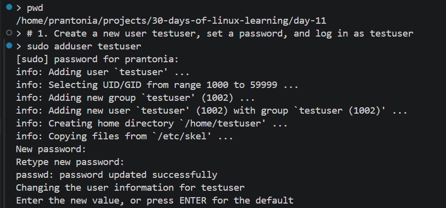
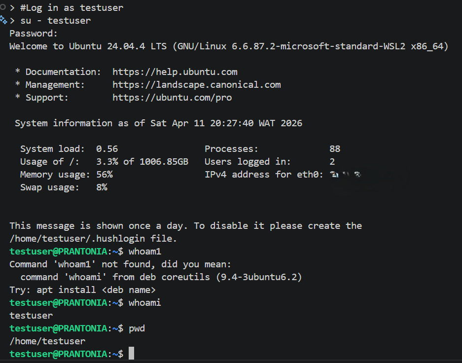
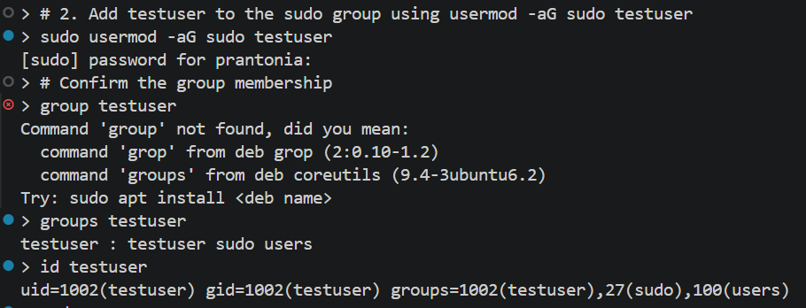
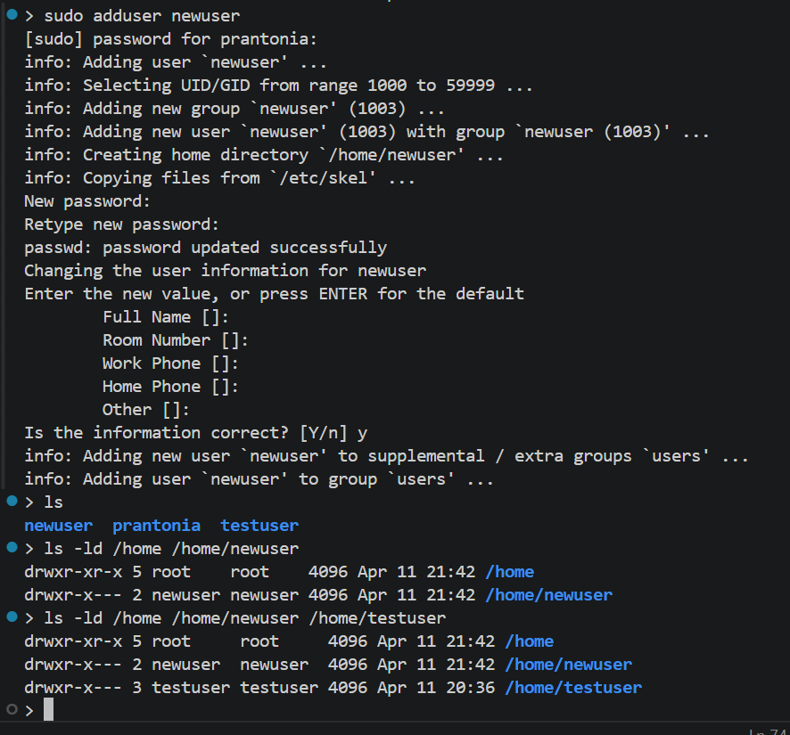
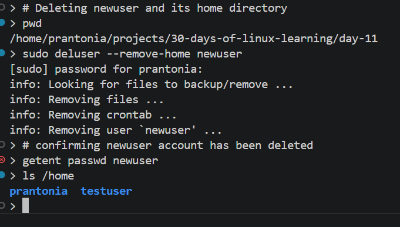

# Day 11 - User and Group Management

## Objective

To understand how Linux users and groups work, how to inspect account information, and how to manage access by creating users, creating groups, and adding users to groups. 

---

## What I Learned

- Linux separates access by users and groups, which helps control permissions and administration.
- `whoami`, `id`, `groups`, and `getent` are useful for checking the current user, UID/GID, and group membership.
- On Ubuntu, the initial administrative account usually gets privilege through the sudo group instead of using the root account directly.
- `adduser` and `addgroup` are common Ubuntu tools for creating normal users and groups. The Ubuntu/Debian man pages describe `adduser` as the standard high-level tool, while `useradd` is the lower-level utility.
- `usermod -aG` groupname username adds a user to a supplementary group, and the `-a` flag should be used with `-G` so existing group memberships are not replaced.

---

## What I Built / Practiced

- Checked my current username, UID, GID, and groups
- Inspected user and group records from the system databases
- Created a new user `testuser`, set a password, and logged in as them
- Added `testuser` to the `sudo` group using `usermod -aG sudo testuser`
- Switched between users using `su - username` and `sudo -i`
- Explored the `sudo` group and understood how admin privileges are granted
- Learned the difference between primary group and supplementary groups
- Reviewed the commands used to create and manage users and groups safely

---

## Challenges Faced

- It took some time to understand the difference between a user account and a group
- I had to be careful with commands like `usermod` because using them incorrectly can remove existing group memberships
- Understanding the difference between `su` and `sudo`
- Why `/etc/shadow` exists separately from `/etc/passwd` (security reasons)

---

## Key Takeaways

- Users and groups are a core part of Linux security and access control
- `id`, `groups`, and `getent` are very useful for understanding account configuration
- On Ubuntu, `sudo` is the normal way to perform administrative tasks instead of enabling the root account directly. The root account should be protected; use `sudo` for privilege escalation instead
- `adduser`/`addgroup` are friendlier for Ubuntu beginners than lower-level account tools.
- In a WSL Ubuntu environment, user and group commands still matter because they affect permissions, ownership, and access inside the Linux filesystem
- Always use `-aG` with `usermod` to append a group, omitting `-a` replaces all groups

---

## Resources

- [The Linux Command Line - Chapter 9: Permissions](https://linuxcommand.org/tlcl.php)
- [How To Add and Delete Users on Ubuntu - DigitalOcean](https://www.digitalocean.com/community/tutorials/how-to-add-and-delete-users-on-ubuntu-20-04)
- Man pages: `man useradd`, `man usermod` (accessible directly in the terminal)

---

## Output

*Figure 1: Practice 1*

---

*Figure 2: Practice 2*

---

*Figure 3: Practice 3*

---

*Figure 4: Practice 4*

---

*Figure 5: Practice 5*

---
