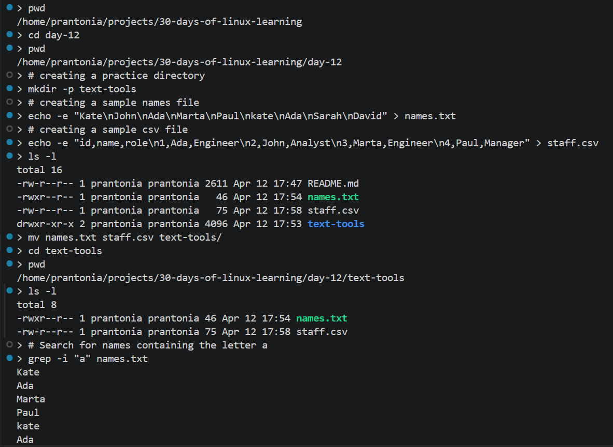
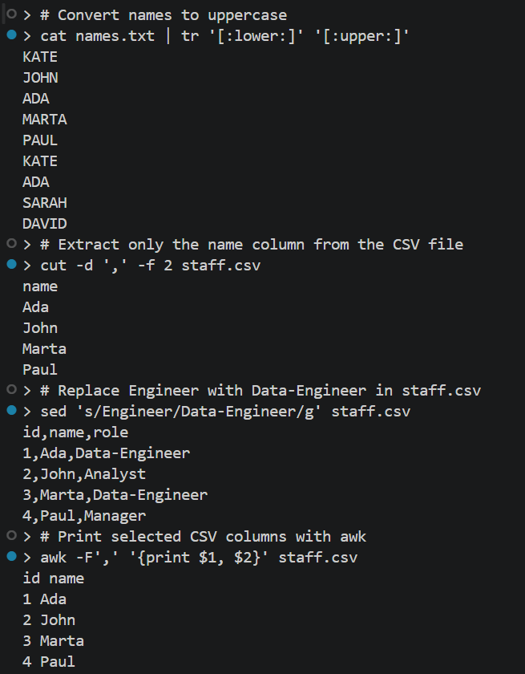
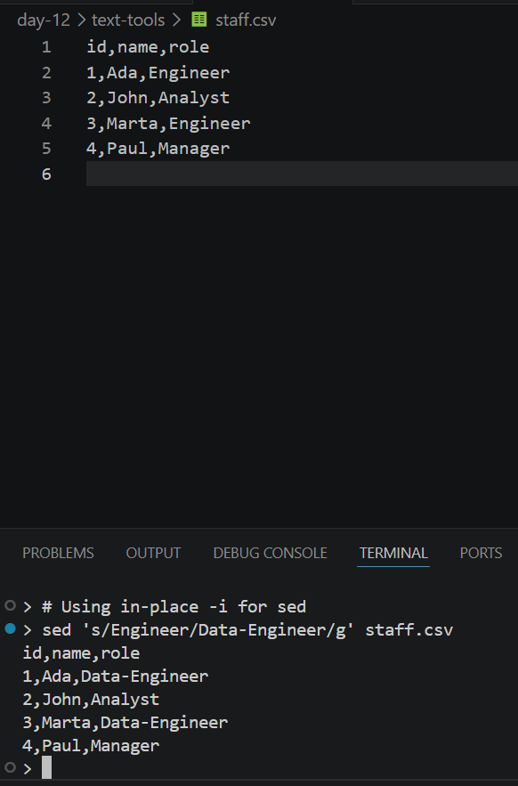
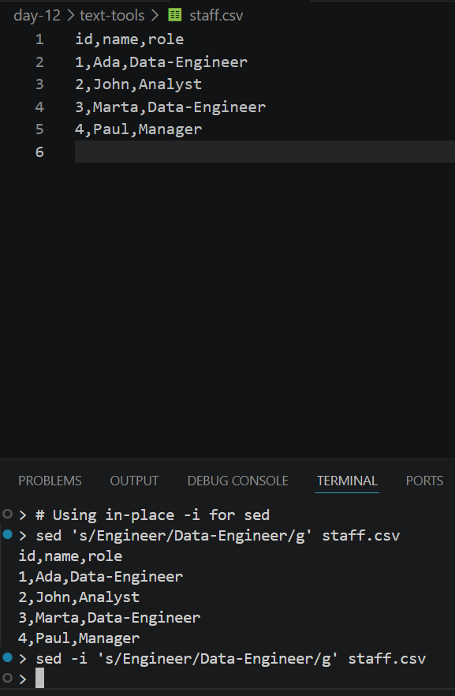

# Day 12 - Text Processing Tools

## Objective

To learn how to inspect, clean, filter, count, sort, and transform text directly from the Linux terminal using common text-processing tools

---

## What I Learned

- `grep` is used to search for patterns in text
- `cut` extracts specific fields or columns from a file
- `sort` arranges lines in order
- `uniq` removes or reports adjacent duplicate lines, so it is often used after sort
- `wc` counts lines, words, and characters
- `tr` translates or deletes characters
- `head` and `tail` show the beginning or end of a file
- `sed` can make quick text substitutions and edits in a stream
- `awk` can select fields and print formatted output from structured text like csv files

---

## What I Built / Practiced

- Created sample text and csv files for practice
- Used `grep` to search for names and keywords
- Used `cut` to extract selected columns from comma-separated data
- Used `sort` and uniq to organize and deduplicate text
- Used `wc` to count lines and words
- Used `tr` to change text to uppercase and replace delimiters
- Used `head` and `tail` to preview file content
- Used `sed` to replace words in text
- Used `awk` to print selected fields from structured data
- Combined commands with pipes to process text step by step

---

## Challenges Faced

- It took some practice to understand the difference between cut, awk, and sed
- Writing correct `awk` field separators and patterns
- Understanding regex syntax used in `grep` and `sed`

---

## Key Takeaways

- Linux text-processing tools are powerful because they let me work with data directly from the terminal
- `grep`, `cut`, `sort`, `uniq`, `sed`, and `awk` are especially useful when working with logs, CSV files, and command output
- `sort | uniq` is a common pattern for cleaning repeated values because `uniq` works on adjacent duplicates only
- `awk` is especially useful for column-based processing, while sed is better for stream editing and substitutions
- Many Linux text-processing tools display processed output in the terminal without changing the original file. This makes it easy to preview transformations safely. To save changes, I must explicitly write the output back to the file or use an in-place editing option.

---

## Resources

- [The Linux Command Line - Chapter 19-21](https://linuxcommand.org/tlcl.php)
- [`Sed` and `Awk` - TheUrbanPenguin on YouTube](https://www.youtube.com/playlist?list=PLtGnc4I6s8dunxo5w2Fef_OOPlRl7AVux)
- [Regex tester and learning tool](https://regexr.com) 
- [freeCodeCamp - The Linux AWK Command](https://www.freecodecamp.org/news/the-linux-awk-command-linux-and-unix-usage-syntax-examples/)
- [Awk Command in Linux with Examples - LinuxHandbook](https://linuxhandbook.com/awk-command-tutorial/)

- [`man grep` / GNU Grep manual](https://www.gnu.org/software/grep/manual/grep.pdf)

---

## Output

*Figure 1: Setting up the text-tools practice directory and using `grep -i` to search names.txt.*

---

*Figure 3: Using `tr`, `cut`, `sed`, and `awk` to transform and extract text from sample files.*

---

*Figure 4: `sed` preview without in-place editing, output changes in the terminal only.*

---

*Figure 5: `sed -i` in-place editing, changes are saved directly to the file*

---
