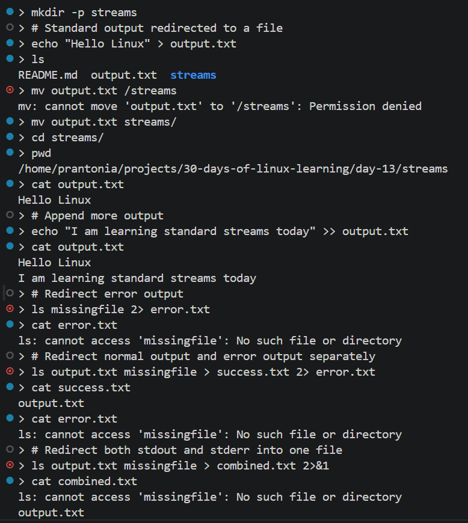
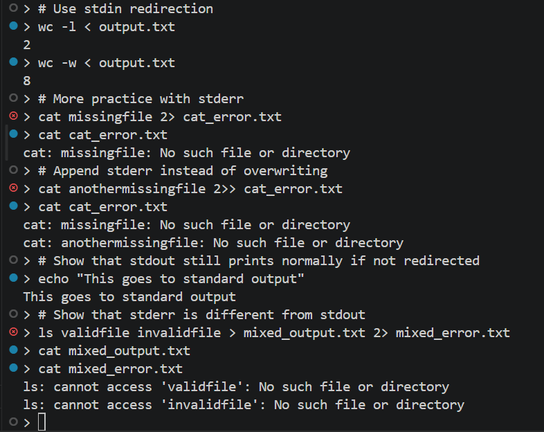

# Day 13 - Standard Streams and Advanced Redirection

## Objective

To understand Linux standard streams and learn how to redirect normal output, error output, and input more intentionally. I wanted to go beyond the basic redirection I practiced earlier and focus on how Linux handles `stdin`, `stdout`, and `stderr`.

---

## What I Learned

- Linux commands use three standard streams:
    - `stdin (0)` for input
    - `stdout (1)` for normal output
    - `stderr (2)` for error output
- `>` redirects standard output to a file and overwrites the file
- `>>` redirects standard output and appends to a file
- `2>` redirects error output to a file
- `2>>` appends error output to a file
- `2>&1` redirects error output to the same destination as standard output
- `<` redirects input from a file into a command
- Separating normal output from errors is useful for troubleshooting and cleaner command workflows

---

## What I Built / Practiced

- Created sample files to test normal output and error output
- Redirected `stdout` into files using `>` and `>>`
- Redirected `stderr` into a separate file using `2>`
- Combined both `stdout` and `stderr` into one file using `2>&1`
- Used `<` to pass file content as input into commands
- Compared terminal output with redirected output files
- Practiced commands that succeed and fail so I could observe the difference between normal output and error output 

---

## Challenges Faced

- It took some time to clearly understand the difference between `stdout` and `stderr`
- I had to be careful with the order of redirection operators
- Some commands produced no visible result in the terminal because the output had already been redirected to a file
- I needed to remember that errors do not go into `>` unless I explicitly redirect them

---

## Key Takeaways

- Linux uses standard streams to handle input, normal output, and error output
- `>` and `>>` only affect normal output unless error output is redirected separately
- `2>` is useful when I want to capture errors only
- `2>&1` is useful when I want both normal output and errors in one place
- Advanced redirection gives me more control over command behavior and helps with debugging

---

## Resources

- [The Linux Command Line - Chapter 6: Redirection](https://linuxcommand.org/tlcl.php)
- [Piping and Redirection! - Ryanstutorials](https://ryanstutorials.net/linuxtutorial/piping.php)
- [Linux-Training - I/O Redirection](https://linux-training.be/funhtml/ch18.html)

---

## Output

*Figure 1: Using `>`, `>>`, `2>`, and `2>&1` to manage standard output and error output.*

---

*Figure 2: Using `<`, `2>`, and `2>>` to test input redirection and error logging.*

---
