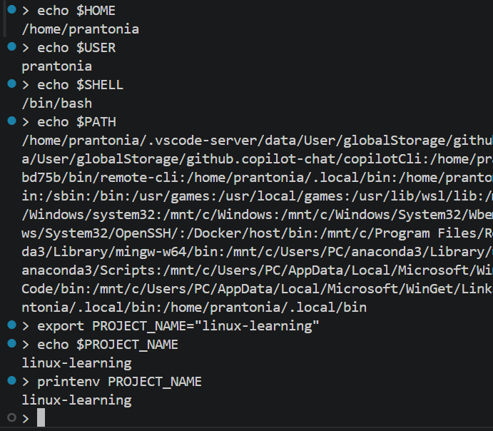
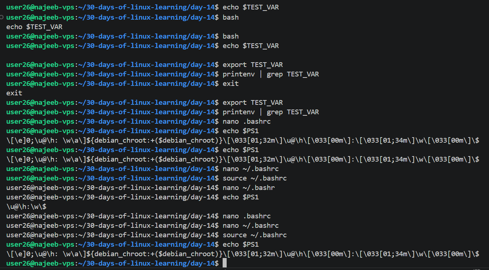

# Day 14 - Environment Variables and Shell Configuration

## Objective

To understand what environment variables are, why they matter in Linux, how to create and export them, and how shell configuration files like `.bashrc` can be used to make settings and aliases persistent.

---

## What I Learned

- Environment variables store values that the shell and programs use while running
- Important variables include:
    - `PATH` for where Linux looks for executable commands
    - `HOME` for my home directory
    - `USER` for my current username
    - `SHELL` for my current shell
- `echo $VAR` prints the value of a variable
- `env` and `printenv` can be used to list environment variables
- `export VAR=value` creates an environment variable for the current session and child processes
- `~/.bashrc` is usually sourced for interactive non-login shells
- `~/.bash_profile` is usually sourced for login shells
- `~/.profile` is a broader profile file often used when .bash_profile is absent
- Variables can be made persistent by adding `export` lines to `~/.bashrc`
- Aliases like `alias ll='ls -la'` can also be added to `~/.bashrc`
- The `PATH` variable is especially important because it controls how Linux finds commands

---

## What I Built / Practiced

- Checked the values of `PATH`, `HOME`, `USER`, and `SHELL`
- Printed variables using `echo`
- Listed variables using `env` and `printenv`
- Created and exported a custom variable
- Opened and inspected `~/.bashrc`
- Added a custom alias to `~/.bashrc`
- Added a persistent exported variable to `~/.bashrc`
- Reloaded the shell config with `source ~/.bashrc`
- Verified that the alias and variable worked

---

## Challenges Faced

- It took some time to understand the difference between temporary variables and persistent ones
- The difference between `.bashrc`, `.bash_profile` and `.profile` was initially confusing
- `PATH` looked long and difficult to read at first
- I had to be careful while editing `~/.bashrc`

---

## Key Takeaways

- Environment variables are an important part of how Linux and applications work
- `PATH` determines where Linux searches for executable programs
- `export` makes variables available beyond just the current shell command line
- `.bashrc` is useful for persistent customizations like aliases and variables
- Shell configuration files help make the Linux environment more efficient and personalized

---

## Resources

- [The Linux Command Line - Chapter 11: The Environment](https://linuxcommand.org/tlcl.php)
- [How to Set Environment Variables in Linux - Linuxize.com](https://linuxize.com/post/how-to-set-and-list-environment-variables-in-linux/)
- [visual PS1 prompt generator](https://bashrcgenerator.com)

---

## Output

*Figure 1: Viewing default environment variables and creating a custom exported variable.*

---

*Figure 2: Editing `.bashrc`, reloading shell configuration, and inspecting the `PS1` prompt variable.*

---
