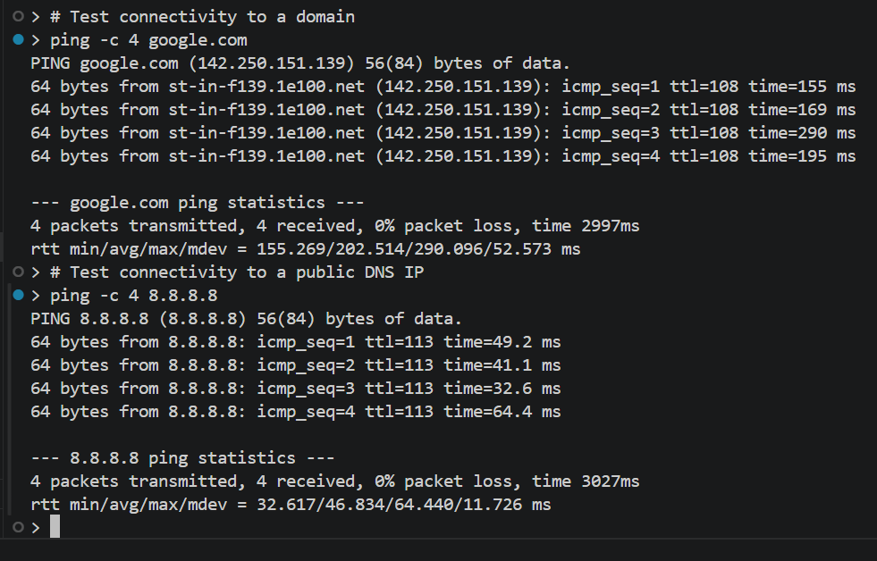
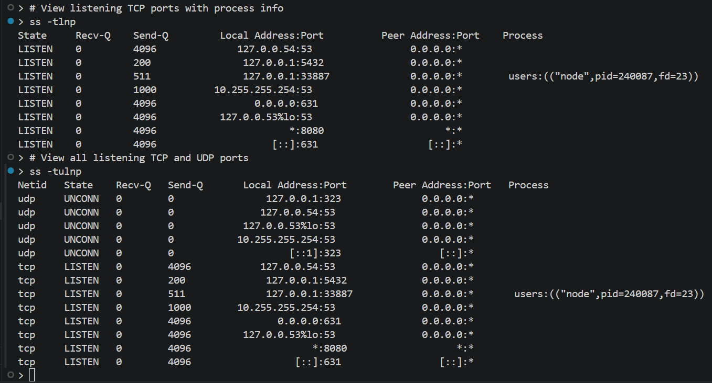
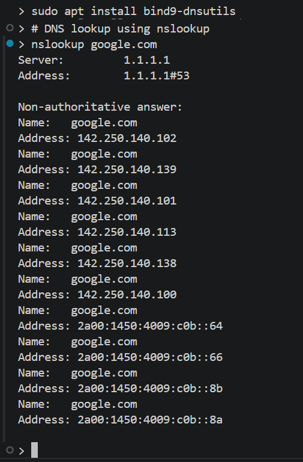
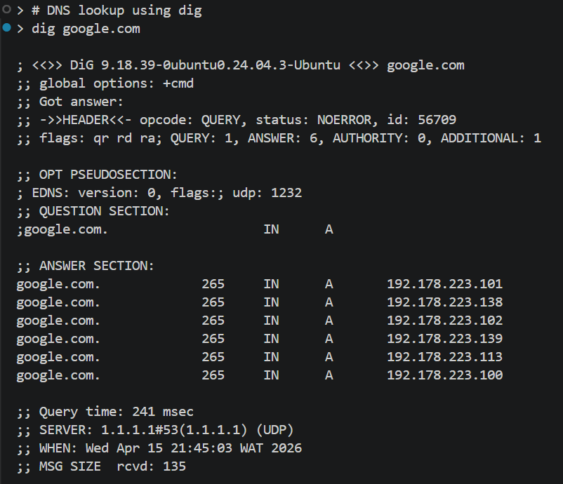
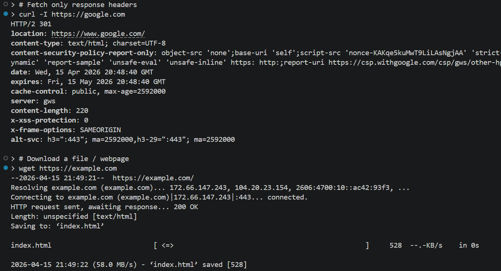

# Day 15 - Networking Basics

## Objective

To understand basic Linux networking concepts and practice commands used to inspect network interfaces, IP addresses, connectivity, DNS resolution, and open connections.

---

## What I Learned

- A computer uses network interfaces to communicate with other systems
- An IP address identifies a device on a network
- `ip addr` shows network interface and IP address information
- `ip route` shows routing information, including the default gateway
- `ping` checks whether a host is reachable
- `ss` can be used to inspect listening ports and active socket connections
- `hostname` and `hostname -I` show system identity and IP-related information
- DNS translates domain names into IP addresses
- `curl` can be used to test access to web resources from the terminal

---

## What I Built / Practiced

- Checked my hostname and local IP information
- Inspected network interfaces using `ip addr`
- Viewed routing information with `ip route`
- Tested network connectivity with `ping`
- Checked DNS resolution with `ping` and `getent hosts`
- Used `ss` to inspect listening ports and network sockets
- Compared local-only addresses like `127.0.0.1` with other network addresses
- Used `curl` to test network access from the command line
- Used `ping` to test connectivity to google.com and `8.8.8.8`
- Listed listening ports on the system using `ss -tlnp`
- Used `dig` or `nslookup` to query DNS records for a domain

---

## Challenges Faced

- It took some time to understand the difference between an interface, an IP address, and a route
- I had to distinguish between local network communication and internet-based communication
- Interpreting the output of `ss -tlnp`

---

## Key Takeaways

- `ip addr` and `ip route` are core commands for understanding Linux networking
- `ping` is useful for quick connectivity checks
- `ss` helps me inspect which services are listening on ports
- `ss -tlnp` is essential for security, know which ports my system is exposing
- `DNS` is important because domain names depend on it to resolve correctly
- Networking basics are useful in Linux, cloud, and Data Engineering because many tools connect to remote systems, APIs, databases, and services

---

## Resources

- [The Linux Command Line - Chapter 16: Networking](https://linuxcommand.org/tlcl.php)
- [Understanding IP Addresses - DigitalOcean Community](https://www.digitalocean.com/community/tutorials/understanding-ip-addresses-subnets-and-cidr-notation-for-networking)
- [Basic Linux Networking Commands - TecMint](https://www.tecmint.com/linux-networking-commands/)
- [Ubuntu Server docs](https://ubuntu.com/server/docs/)
- [OverTheWire Bandit](https://overthewire.org/wargames/bandit/)
- [The Missing Semester](https://missing.csail.mit.edu/)

---

## Output

*Figure 1: Network connectivity test with `ping`.*

---

*Figure 2: Listening ports and active sockets with `ss`.*

---

*Figure 3: DNS lookup using `nslookup`.*

---

*Figure 4: DNS query details with `dig`.*

---

*Figure 5: HTTP requests with `curl` and `wget`.*

---
