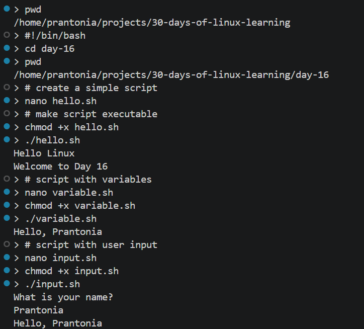
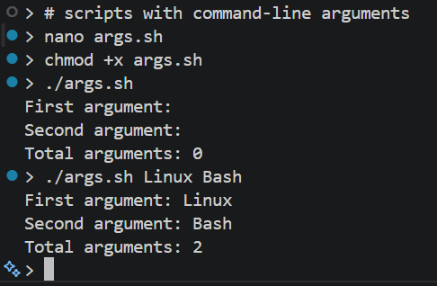
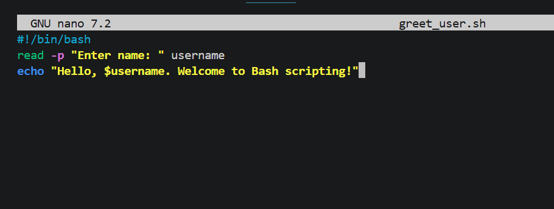
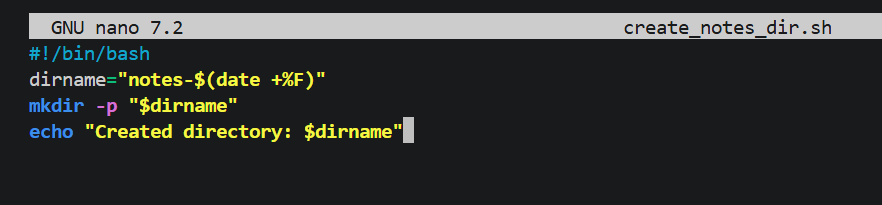
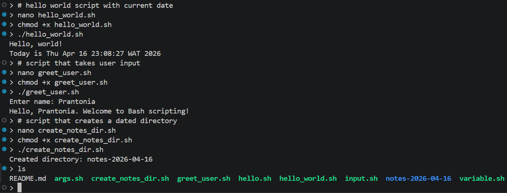

# Day 16 - Introduction to Bash Scripting

## Objective

To understand the fundamentals of Bash scripting, learn how to automate repetitive terminal tasks, and begin writing simple shell scripts that can be executed directly from the Linux terminal.

---

## What I Learned

- A Bash script is a text file that contains a sequence of Linux commands
- Scripts help automate repetitive tasks and workflows
- The first line of a Bash script is usually the shebang
```
#!/bin/bash
```
- The shebang tells Linux which interpreter should execute the script
- `chmod +x script.sh` makes a script executable
- Variables can be created and used inside scripts
- `echo` is commonly used for output
- User input can be collected using `read`
- Scripts can use positional parameters such as:
    - `$1` = first argument
    - `$2` = second argument
    - `$#` = number of arguments
- Comments start with `#`
- Scripts can include basic conditions and loops

---

## What I Built / Practiced

- Created my first Bash script
- Added a shebang line
- Printed text output using echo
- Created and used variables
- Accepted user input with read
- Passed arguments into a script
- Made the script executable using `chmod +x`
- Executed the script directly from the terminal
- Wrote a `hello_world.sh` script that prints a greeting along with the current date
- Created a script that accepts a user’s name as input and prints a personalized message
- Wrote a script that creates a dated directory for daily notes

---

## Challenges Faced

- Understanding why the shebang line is important
- Remembering to make the script executable
- Differentiating between running a script with `bash script.sh` and `./script.sh`
- Understanding how positional parameters work

---

## Key Takeaways

- Bash scripting is useful for automating Linux tasks
- Scripts are essentially reusable terminal workflows
- The shebang line tells Linux how to run the script
- `chmod +x` is necessary for direct execution
- Quoting variables correctly (`$VAR` vs `"$VAR"`) prevents bugs with spaces in values
- The shebang line is not just a comment - it defines the script interpreter

---

## Resources

- [The Linux Command Line - Part IV: Writing Shell Scripts]((https://linuxcommand.org/tlcl.php))
- [GNU Bash Manual](https://www.gnu.org/software/bash/manual/)
- [freeCodeCamp Bash Scripting Tutorial](https://www.freecodecamp.org/news/bash-scripting-tutorial-linux-shell-script-and-command-line-for-beginners/)
- [Bash Scripting Cheatsheet](devhints.io/bash)


---

## Output



*Figure 1: Basic Bash scripts (hello, variables, input)*

---



*Figure 2: Command-line arguments in Bash scripts.*

---


*Figure 3: Interactive script using `read`*

---


*Figure 4: Automating directory creation with Bash*

---


*Figure 5: Running and validating multiple scripts*

---
