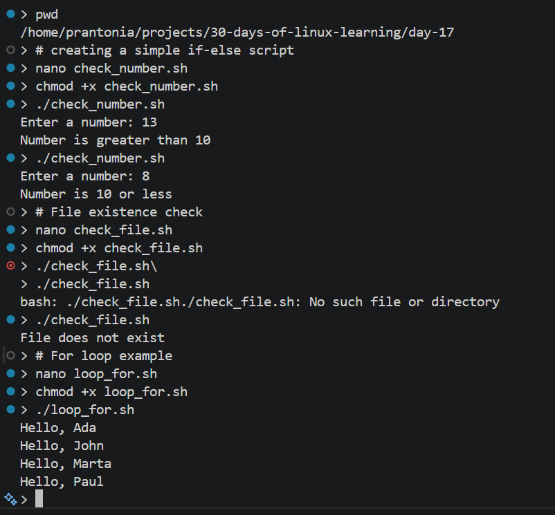
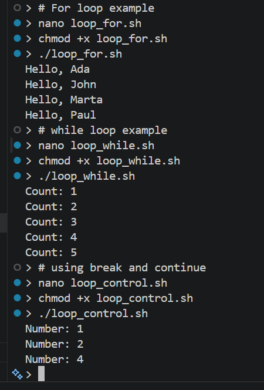
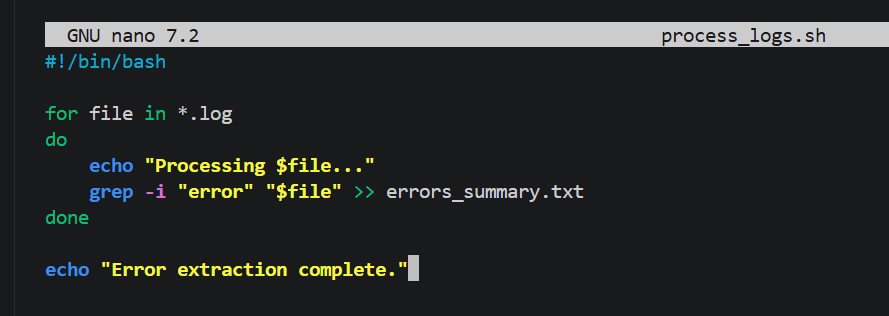
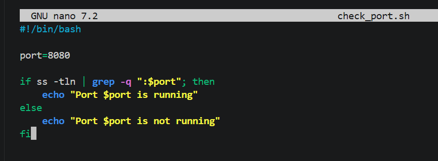
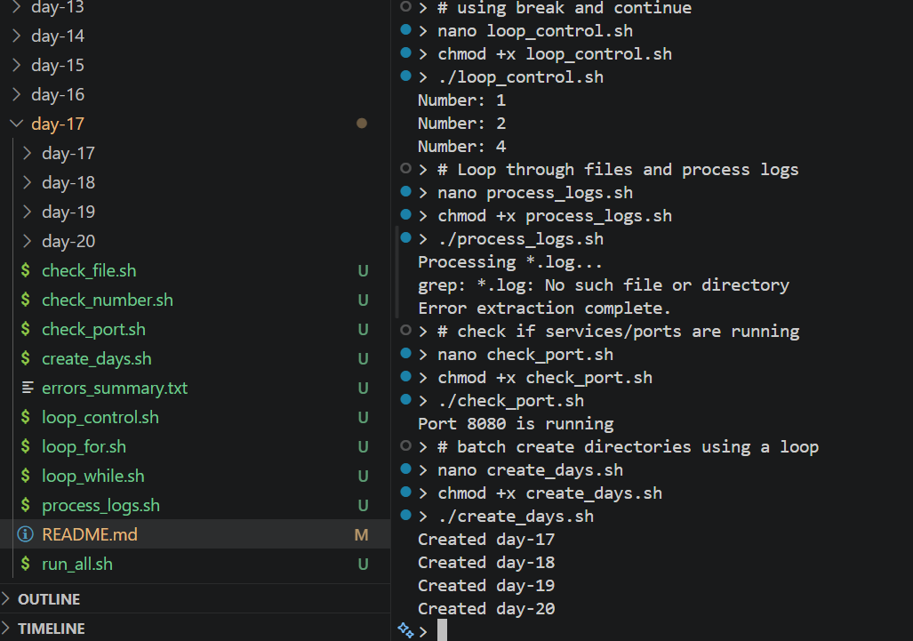
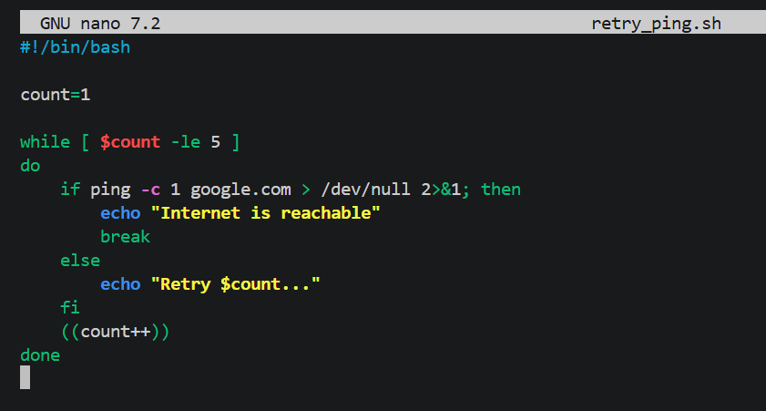
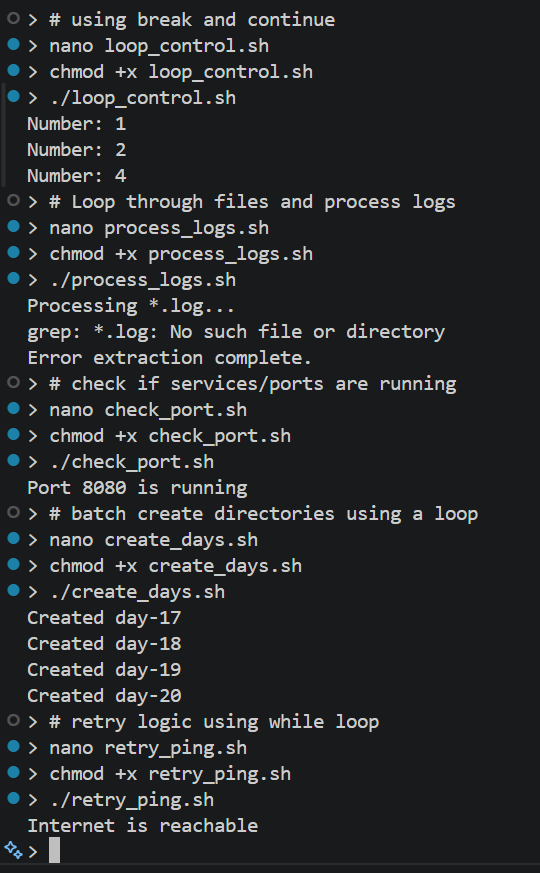

# Day 17 - Bash Conditionals and Loops

## Objective

To learn how to add logic and control flow to Bash scripts using conditionals and loops. This allows scripts to make decisions and repeat tasks automatically.

---

## What I Learned

- `if`, `elif`, and `else` are used for conditional logic
- Conditions are written inside `[ ]` or `[[ ]]`
- Common comparison operators:
    - `-eq`, `-ne`, `-gt`, `-lt` (numbers)
    - `=`, `!=` (strings)
    - `-f`, `-d` (file checks)
- `for` loops are used to iterate over a list of items
- `while` loops run as long as a condition is true
- `break` stops a loop early
- `continue` skips the current iteration
- `$?` stores the exit status of the last command (0 = success)

---

## What I Built / Practiced

- Wrote scripts using `if-else` statements to check conditions
- Created scripts to compare numbers and strings
- Checked if files or directories exist
- Used `for` loops to iterate over lists and files
- Used `while` loops for repeated execution
- Practiced loop control using `break` and `continue`

---

## Challenges Faced

- Remembering the correct syntax for conditionals (`[ ]` vs `[[ ]]`)
- Understanding numeric vs string comparison operators
- Getting loop syntax correct (especially do and done)
- Avoiding syntax errors like missing spaces inside `[ ]`

---

## Key Takeaways

- Conditionals allow scripts to make decisions dynamically
- Loops allow repetitive tasks to be automated efficiently
- Combining conditionals and loops makes Bash scripts much more powerful
- Always check if files/directories exist before operating on them - prevents errors
- Use `[[ ]]` (double brackets) over `[ ]` in modern bash - it's safer and more powerful

---

## Resources

- [GNU Bash Manual](https://www.gnu.org/software/bash/manual/)
- [freeCodeCamp Bash Scripting Tutorial](https://www.freecodecamp.org/news/bash-scripting-tutorial-linux-shell-script-and-command-line-for-beginners/)
- [The Linux Command Line - Chapter 29: Flow Control: Looping with while / until](https://linuxcommand.org/tlcl.php)
- [Bash if else Statement - Linuxize.com](https://linuxize.com/post/bash-if-else-statement/)
- [Bash For Loop - Linuxize.com](https://linuxize.com/post/bash-for-loop/)

---

## Output

*Figure 1: If-else conditions and basic loop execution*

---

*Figure 2: `For` loops, `while` loops, and loop control (`break`, `continue`)*

---

*Figure 3: Log processing automation with Bash*

---

*Figure 4: Port status check using conditionals*

---

*Figure 5: Running multiple automation scripts*

---

*Figure 6: Retry logic with while loop*

---

*Figure 7: Combined Bash automation workflows*

---
