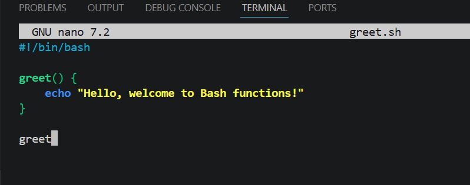
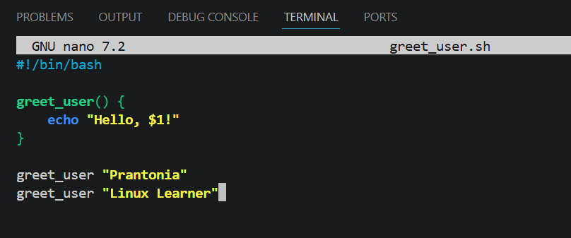
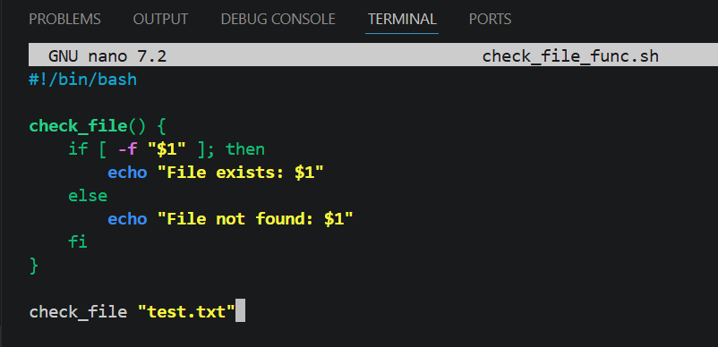
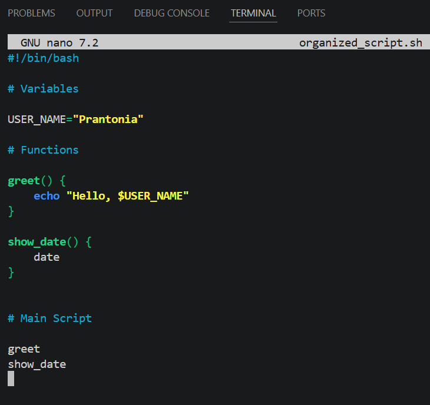
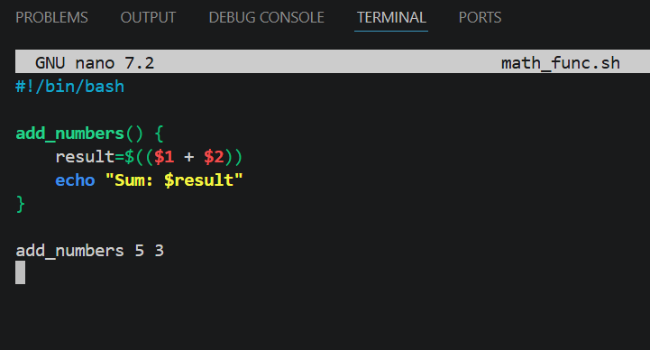
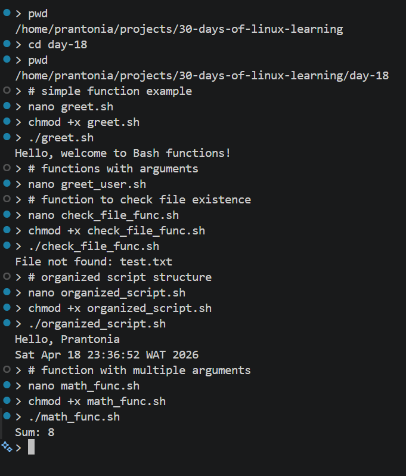

# Day 18 - Bash Functions and Script Organization

## Objective

To learn how to structure Bash scripts using functions, improve code reusability, and organize scripts in a cleaner and more maintainable way.

---

## What I Learned

- Functions allow grouping of commands into reusable blocks
- Function syntax in Bash:
    ```
    function_name() {
        # commands
    }
    ```
- Functions are called by simply using their name
- Functions can accept arguments using `$1`, `$2`, etc.
- `$@`represents all arguments passed to a function
- `$#` gives the number of arguments
- `return` is used to exit a function (returns exit status, not values)
- `echo` is commonly used to output values from functions
- Scripts can be organized into sections:
    - variables
    - functions
    - main execution logic
- Good naming and structure improve readability and maintainability

---

## What I Built / Practiced

- Created functions to avoid repeating code
- Wrote functions that accept arguments
- Built scripts with clearly separated sections (functions + main logic)
- Used functions for tasks like:
    - printing messages
    - validating input
    - checking file existence
- Improved script readability by organizing logic into reusable blocks

---

## Challenges Faced

- Understanding how arguments work inside functions
- Variable scope, local vs global variables in functions
- Remembering that return only returns exit status (0–255)
- Getting used to structuring scripts instead of writing everything line-by-line
- Debugging when functions were not called correctly

---

## Key Takeaways

- Functions make scripts cleaner and easier to maintain
- Reusable code reduces duplication and errors
- check exit codes (`$?`) after critical commands to handle errors properly
- Organizing scripts into sections makes them more professional
- Bash scripting is moving closer to real programming practices
- This is important for automation, DevOps, and Data Engineering workflows

---

## Resources

- [The Linux Command Line - Chapter 27: Flow Control: Branching with if]((https://linuxcommand.org/tlcl.php))
- [Bash Functions - Linuxize.com](https://linuxize.com/post/bash-functions/)
- [shellcheck.net](https://www.shellcheck.net/)

---

## Output


*Figure 1: Simple reusable Bash function*

---


*Figure 2: Functions with arguments*

---


*Figure 3: File existence check with functions*

---



*Figure 4: Structured Bash script organization*

---



*Figure 5: Arithmetic function with parameters*

---



*Figure 6: Running multiple function-based scripts*

---
