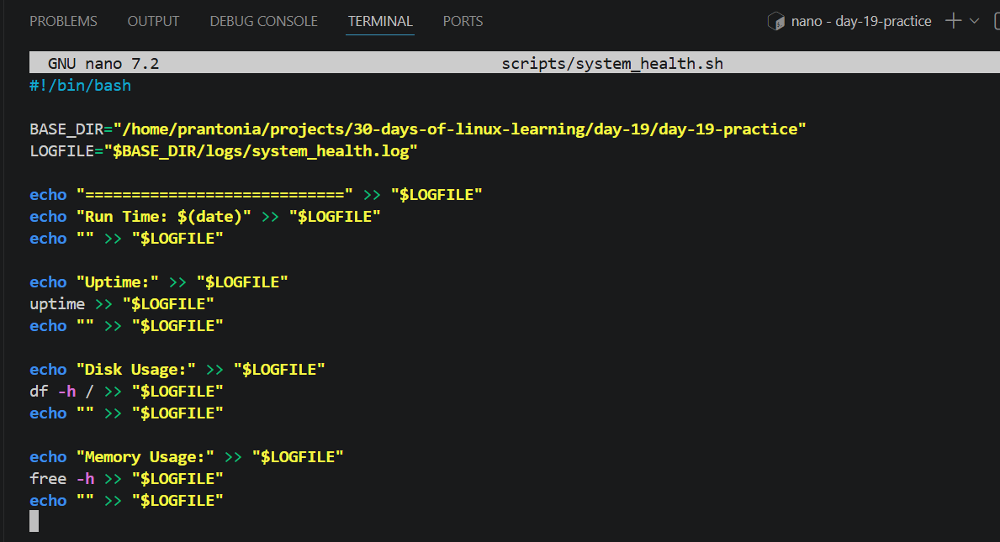
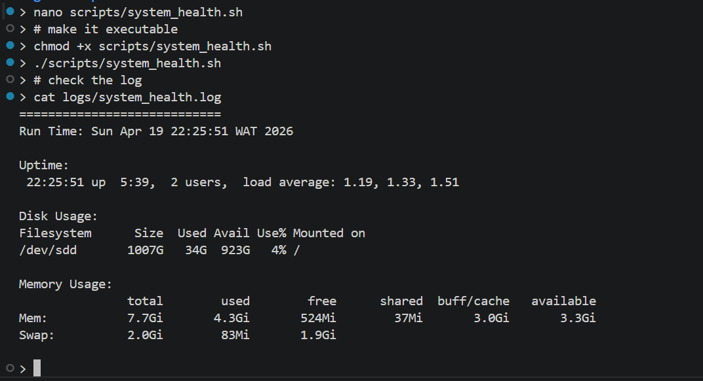
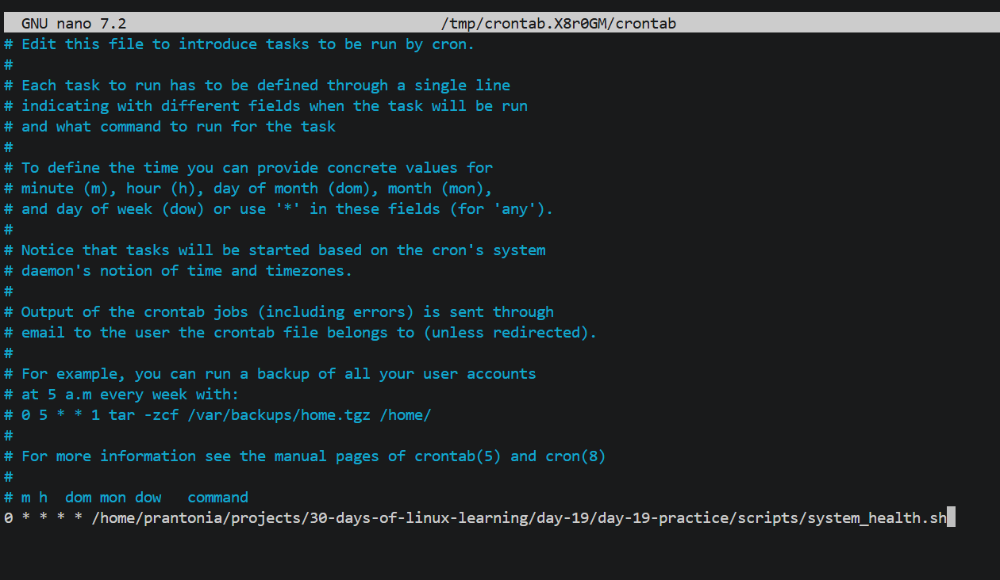

# Day 19 - Cron Jobs and Task Scheduling

## Objective

To understand how Linux schedules recurring tasks using cron, learn how to manage cron jobs, and automate commands or scripts to run at specific times without manual intervention.

---

## What I Learned

- cron is a time-based job scheduler used to run commands automatically
- crontab is used to manage scheduled tasks for a user
- View current cron jobs with:
`crontab -l`
- Edit cron jobs with:
`crontab -e`
- Remove cron jobs with:
`crontab -r`
- Standard cron format has five time fields plus the command:
```
* * * * * command_to_run
│ │ │ │ │
│ │ │ │ └── Day of week (0–7)
│ │ │ └──── Month
│ │ └────── Day of month
│ └──────── Hour
└────────── Minute
```
Example:
`0 9 * * * script.sh` runs every day at 9:00 AM
- `cron` uses absolute paths more reliably than relative paths
- Redirecting output to log files helps with debugging cron jobs
- Environment variables may be limited inside cron jobs

---

## What I Built / Practiced

- Created a structured day-19 workspace with separate scripts and logs folders
- Wrote a Bash script that logs system health information
- Made the script executable and tested it manually
- Scheduled the script with cron using an absolute path
- Verified output by checking the generated log file

---

## Challenges Faced

- Understanding the five-field cron syntax
- Remembering the difference between day-of-month and day-of-week
- Using full file paths instead of relative paths

---

## Key Takeaways

- cron is powerful for automation and recurring tasks
- Use full paths for commands and scripts
- Redirect output to logs for troubleshooting
- Cron is useful for backups, reports, monitoring, cleanup jobs, and ETL pipelines

---

## Resources

- [How to Use Cron to Schedule Jobs - DigitalOcean](https://www.digitalocean.com/community/tutorials/how-to-use-cron-to-automate-tasks-ubuntu-1804)
- [Cron Job Logging Best Practices - Cronitor.io](https://cronitor.io/guides/cron-jobs)
- [visual cron expression editor](https://crontab.guru)

---

## Output


*Figure 1: Building the system health monitoring script*

---


*Figure 2: Manual script execution and log verification*

---


*Figure 3: Scheduling the script with cron using crontab*

---
