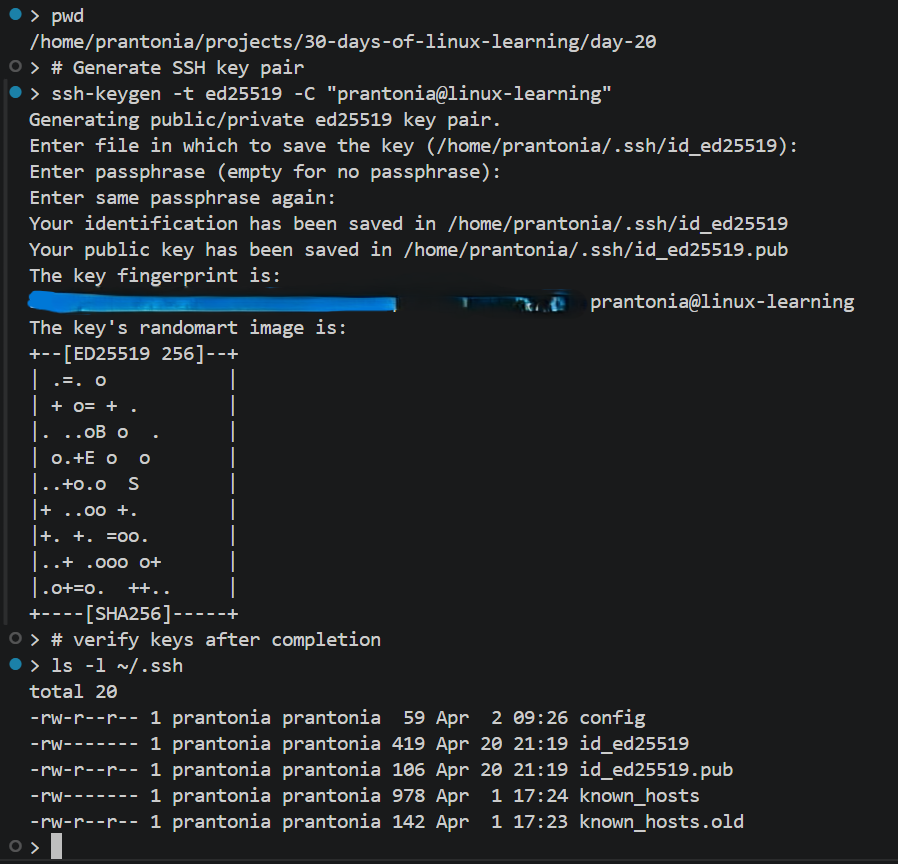
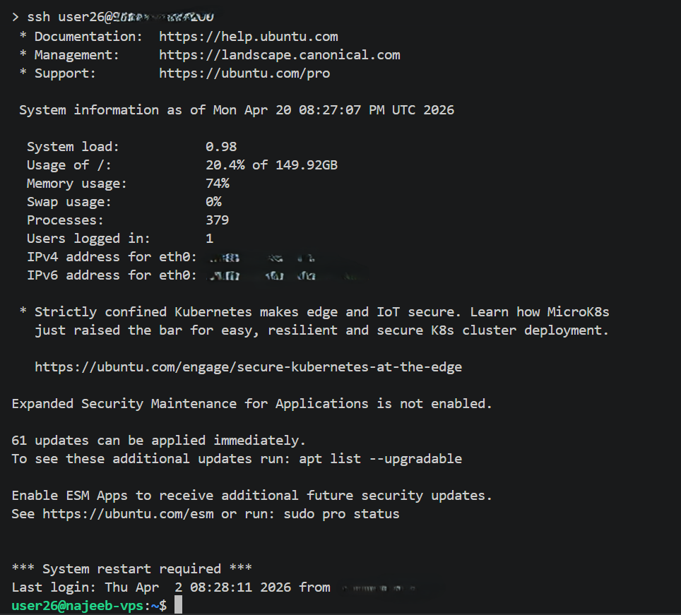
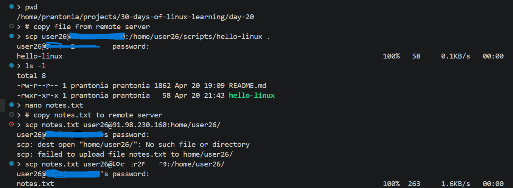
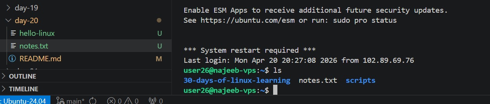

# Day 20 - SSH and Remote Access

## Objective

To understand how Linux systems are accessed remotely using SSH, learn secure remote login basics, and practice transferring files and managing remote servers from the terminal.

---

## What I Learned

- SSH (Secure Shell) is used to securely connect to remote systems over a network
- Basic SSH syntax:
```
    ssh username@server_ip
```
- Example:
```
    ssh prantonia@192.168.1.10
```
- SSH uses encrypted communication
- Common default port is 22
- Generate SSH keys using:
```
    ssh-keygen
```
- Copy public key to remote server:
```
    ssh-copy-id username@server_ip
```
- File transfer with `scp`
```
    scp file.txt user@server:/path/
```
- Secure file sync with `rsync`
```
    rsync -avz folder/ user@server:/path/
```
- SSH config file simplifies connections:
```
    ~/.ssh/config
```
- VS Code Remote SSH allows coding on remote servers as if local

---

## What I Built / Practiced

- Connected to a remote Linux machine using SSH
- Practiced SSH login syntax with username and IP address
- Generated SSH key pairs
- Viewed public/private keys in `~/.ssh/`
- Practiced copying files using scp
- Used `rsync` for folder synchronization
- Learned how VS Code Remote SSH improves workflow

---

## Challenges Faced

- Understanding public vs private SSH keys
- Remembering IP + username syntax
- Distinguishing password login vs key-based login
- Host authenticity prompts on first connection
- Managing permissions for SSH keys

---

## Key Takeaways

- SSH is one of the most important Linux administration tools
- Key-based authentication is more secure than passwords
- `scp` and `rsync` are essential for remote file transfers
- SSH enables remote server management, cloud access, and automation

---

## Resources

- [Using the SSH Config File - Linuxize.com](https://linuxize.com/post/using-the-ssh-config-file/)
- [Security Guide: Hardening SSH](ssh.com/academy/ssh/sshd)


---

## Output


*Figure 1: SSH key generation and verification*

---


*Figure 2: Remote VPS login using SSH*

---


*Figure 3: Uploading and downloading files with `scp`*

---


*Figure 4: Confirming successful local and remote file transfers*

---
