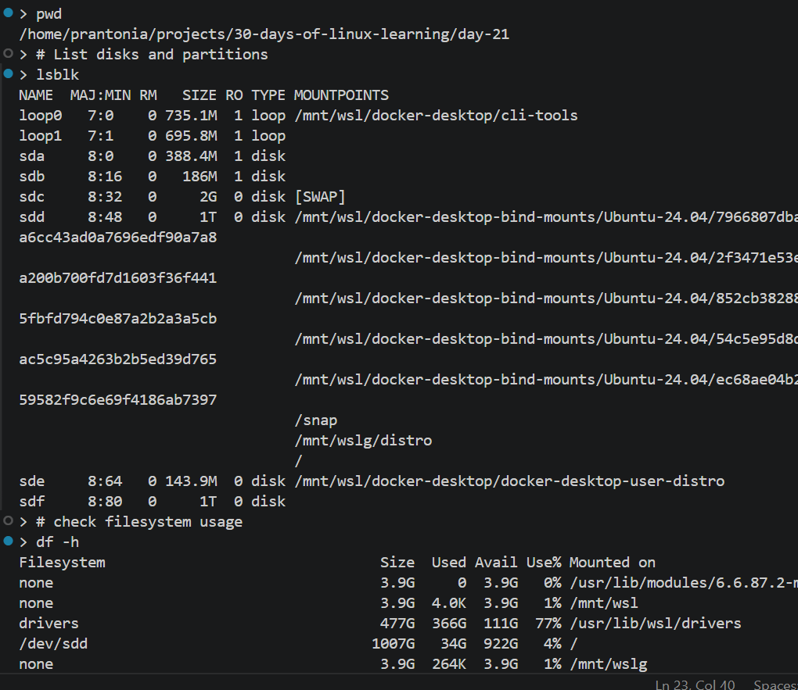
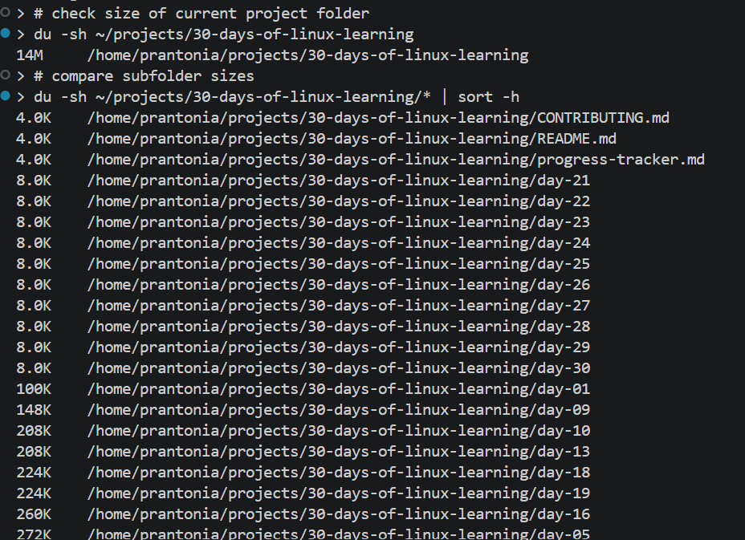
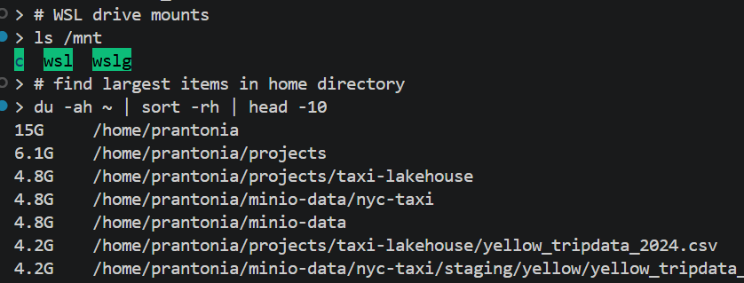
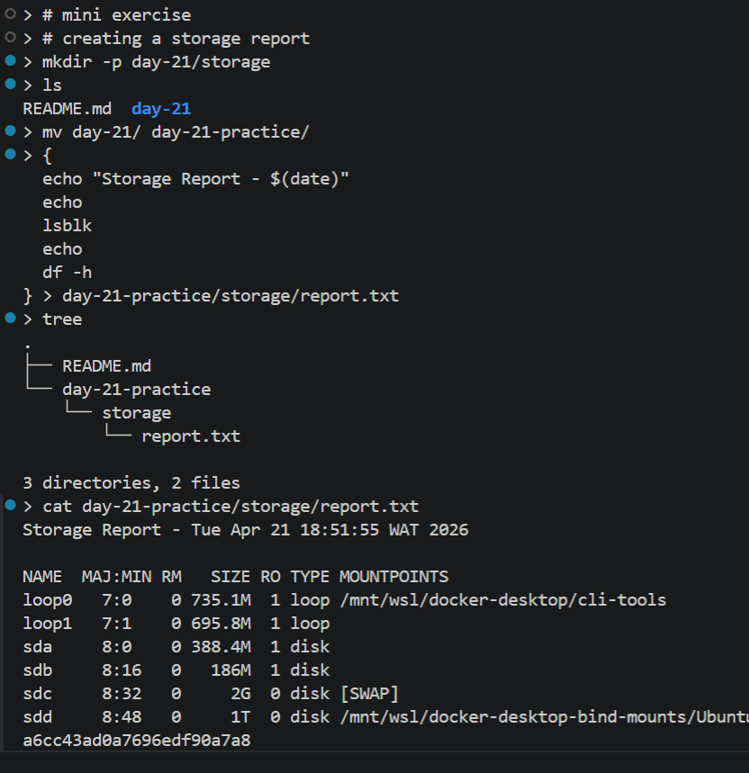

# Day 21 - Disk Management and Storage

## Objective

To learn how Linux manages disks, partitions, filesystems, mounted storage, and disk usage. Practice inspecting available storage, checking space consumption, and understanding how disks are attached to the system.

---

## What I Learned

- Linux exposes disks and partitions as block devices (examples: `/dev/sda`, `/dev/sdb`, `/dev/nvme0n1`)
- Common commands for storage inspection:
    - `lsblk` → list disks, partitions, mount points
    - `df -h` → filesystem disk usage
    - `du -sh <dir>` → directory size usage
    - `fdisk -l` → partition tables (usually requires sudo)
    - `blkid` → filesystem UUIDs and types
    - `mount` / `umount` → attach or detach filesystems
- Filesystems store data structures on partitions (ext4, xfs, btrfs, vfat, ntfs)
- Mount points connect a device to the directory tree (e.g. `/`, `/mnt/data`)
- `df` shows used/free space by mounted filesystem
- `du` shows how much space files/folders consume
- UUIDs are commonly used in `/etc/fstab` for persistent mounts
- WSL may show Windows drives mounted under `/mnt/c`, `/mnt/d`, etc.

---

## What I Built / Practiced

- Inspected available disks and partitions using `lsblk`
- Checked root filesystem usage with `df -h`
- Compared folder sizes using `du -sh`
- Viewed mounted filesystems and mount points
- Explored WSL-mounted Windows drives under `/mnt`
- Reviewed filesystem UUIDs using `blkid`
- Created a practice mount directory (`/mnt/testdisk`) conceptually for learning

---

## Challenges Faced

- Understanding the difference between **disk**, **partition**, and **filesystem**
- Interpreting multiple loop devices or WSL virtual disks
- Distinguishing `df` vs `du`
- Understanding why one folder can fill disk space even when `df` still looks healthy overall
- Learning that unmounting busy filesystems will fail

---

## Key Takeaways

- `lsblk` gives the clearest high-level picture of storage layout
- `df` answers: **How full is the filesystem?**
- `du` answers: **What is using the space?**
- Mount points are how Linux makes storage accessible
- UUID-based mounts are more reliable than device names
- Disk awareness is essential for servers, databases, pipelines, and logs

---

## Resources

- [How to Check Disk Space in Linux - GeeksforGeeks](https://www.geeksforgeeks.org/linux-unix/checking-disk-space-in-linux/)
- [Understanding the /etc/fstab File in Linux — Linuxize.com](https://linuxize.com/post/etc-fstab-file/)
- `Man` pages: `man df`, `man du`, `man lsblk`

---

## Output

*Figure 1: Viewing disks, partitions, and filesystem usage*

---

*Figure 2: Comparing project folder sizes with `du`*

---

*Figure 3: Inspecting WSL mounts and largest folders*

---

*Figure 4: Generating a storage report with shell redirection*

---
