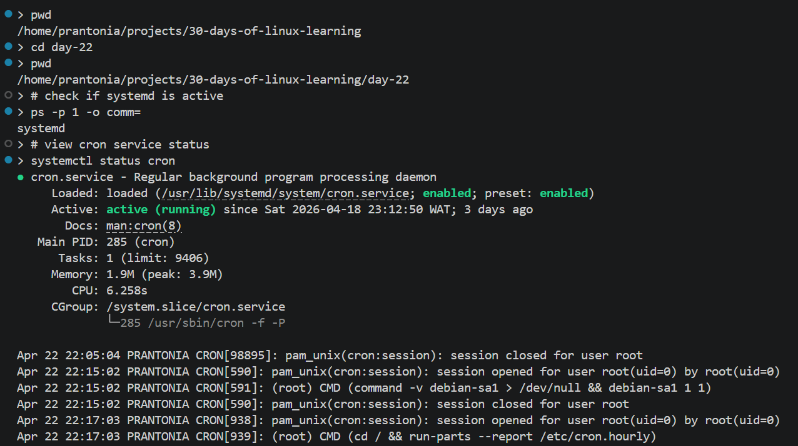
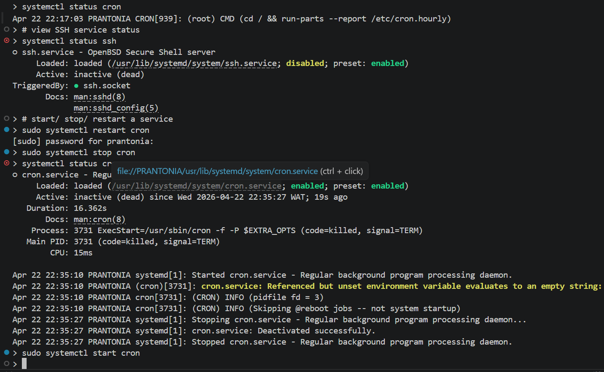
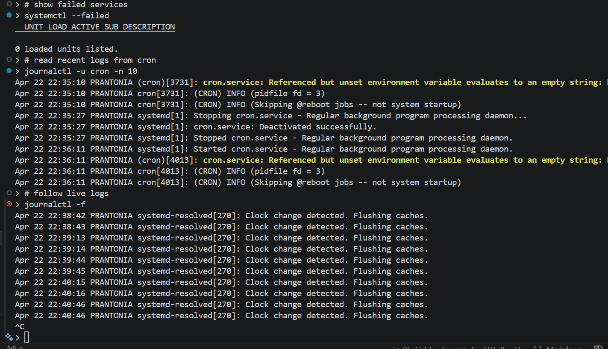
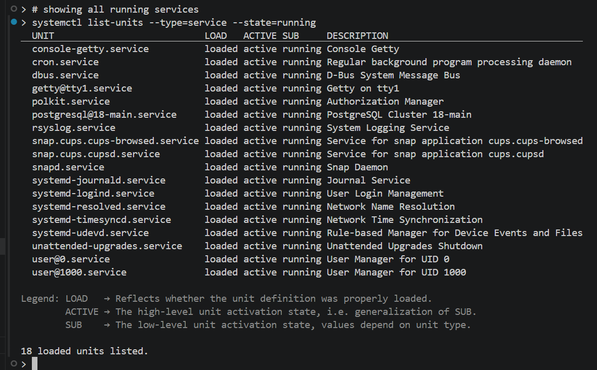
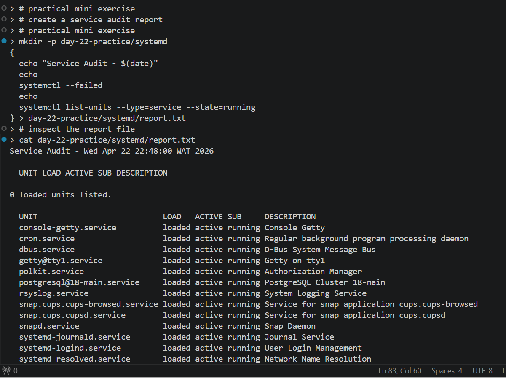

# Day 22 - Systemd and Service Management

## Objective

To learn how Linux manages background services using **systemd**, understand service states, inspect logs, and practice starting, stopping, enabling, and troubleshooting services.

---

## What I Learned

- systemd is the init system and service manager used by most modern Linux distributions
- It manages services, boot targets, timers, sockets, mounts, and system startup
- Core command:
```
    systemctl
```
- Common service actions:
```
    systemctl status <service>
    systemctl start <service>
    systemctl stop <service>
    systemctl restart <service>
    systemctl reload <service>
    systemctl enable <service>
    systemctl disable <service>
```
- View boot-time failures:
```
    systemctl --failed
```
- Check startup behavior:
```
    systemctl is-enabled ssh
```
- Logs are viewed with:
```
    journalctl
```
- Recent logs for one service:
```
    journalctl -u cron -n 50
```
- Real-time logs:
```
    journalctl -f
```
- Unit files usually live in:
```
    /etc/systemd/system
    /lib/systemd/system
```

---

## What I Built / Practiced

- Checked service status for `cron`, `ssh`, and networking services
- Started and restarted services safely
- Enabled services to start on boot
- Viewed recent logs with `journalctl`
- Listed failed services
- Verified cron service state from previous Day 19 practice
- Created a custom demo service (this was an optional advanced practice)

---

## Challenges Faced

- Understanding the difference between active, enabled, and running
- Knowing when to use restart vs reload
- Reading verbose logs from `journalctl`

---

## Key Takeaways

- `systemctl status` is the first command to run when troubleshooting services
- `enable` controls boot startup; `start` controls current session state
- `journalctl` is essential for diagnosing service failures
- systemd powers most production Linux servers
- Knowing service management is core DevOps / SysAdmin skill

---

## Resources

- [How to Create a Systemd Service - Linuxhandbook.com](http://linuxhandbook.com/create-systemd-services/)
- `man` page: `man systemctl`, `man journalctl`

---

## Output


*Figure 1: Verified `systemd` as PID 1 and checked active `cron` service status.*

---


*Figure 2: Inspected SSH service and practiced restarting, stopping, and starting `cron`*

---


*Figure 3: Checked for failed services and viewed recent/live cron logs*

---


*Figure 4: Listed all running system services with `systemctl`*

---


*Figure 5: Created a Service Audit Report and saved the output to `report.txt`*

---