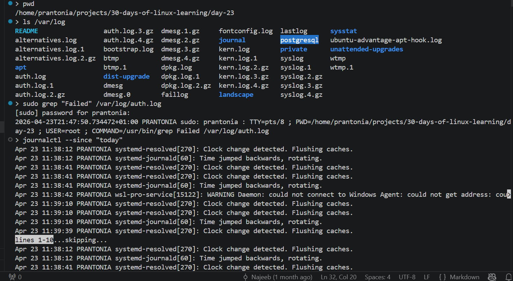
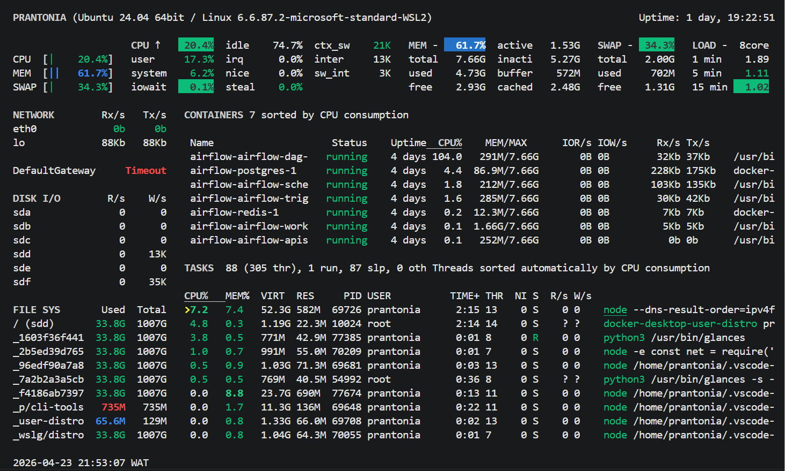
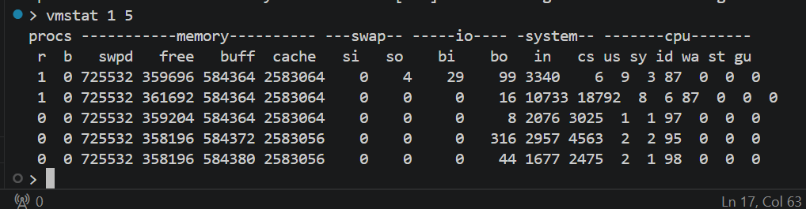

# Day 23 - Log Management and System Monitoring

## Objective

To understand where system logs are stored, how to read them, and how to monitor overall system health using common Linux tools.

---

## What I Learned

- `/var/log/` directory stores most traditional Linux log files
- Important logs include `syslog`, `auth.log`, `kern.log`, `dpkg.log`, and web server logs like `nginx/access.log`
- `journalctl` is the centralized log viewer for `systemd` systems
- `logrotate` automatically rotates, compresses, and manages old logs
- `dmesg` displays kernel and hardware-related messages
- Monitoring tools include `htop`, `iotop`, `iftop`, `vmstat`, and `iostat`
- `last` and `who` show user login history and active sessions

---

## What I Built / Practiced

- Used grep on `/var/log/auth.log` to search for failed login attempts
- Used `journalctl --since "today"` to inspect today’s system events
- Installed and used `iotop` to monitor disk I/O activity by process
- Created a log analysis script that counts error occurrences per hour

---

## Challenges Faced

- Some log files may require `sudo` permission to access
- Log outputs can be large and noisy without filtering
- Certain monitoring tools may need installation first
- Log files rotating away before you can read them
- Understanding the `journalctl --since` and `--until` flags format

---

## Key Takeaways

- Logs are critical for troubleshooting and auditing system activity
- `journalctl` simplifies log management on modern Linux systems
- Monitoring tools help identify CPU, memory, disk, and network bottlenecks
- Filtering logs with tools like `grep`, `less`, and `tail -f` improves efficiency
- Regularly reviewing auth.log for failed logins is a basic security practice
- `dmesg` is invaluable for diagnosing hardware and driver issues

---

## Resources

- [Log Management in Linux - GeeksforGeeks](https://www.geeksforgeeks.org/techtips/how-to-manage-logs-in-linux/)
- [How To Monitor System Authentication Logs on Ubuntu - DigitalOcean](https://www.digitalocean.com/community/tutorials/how-to-monitor-system-authentication-logs-on-ubuntu)
- [GoAccess - real-time terminal web log analyzer](https://goaccess.io/)

---

## Output

*Figure 1: Checked system logs with `/var/log`, `grep`, and `journalctl`*

---

*Figure 2: Monitored CPU, memory, disk, and processes using `glances`*

---

*Figure 3: Used `vmstat` to view real-time system performance stats*

---
