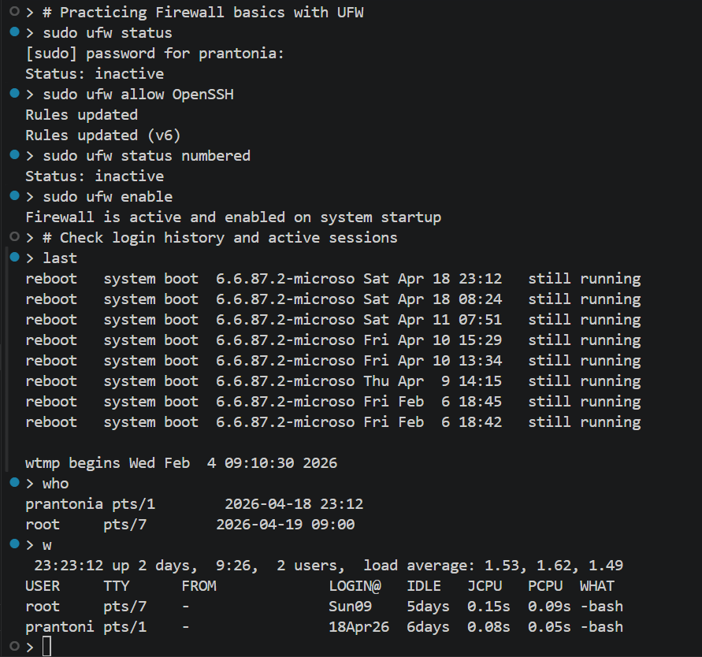
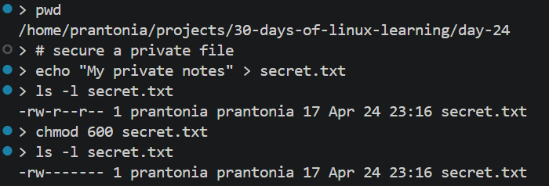
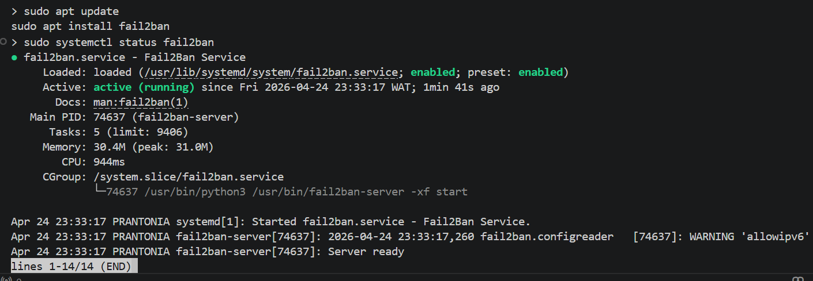

# Day 24 - Linux Security Basics

## Objective

To learn foundational Linux security practices such as user permissions, secure authentication, firewall basics, updates, and system hardening.

---

## What I Learned

- Linux security starts with least privilege and proper user access
- `chmod`, `chown`, and `umask` control file permissions and ownership
- `sudo` allows temporary elevated privileges instead of logging in as root
- Strong passwords and SSH keys improve authentication security
- Disable root SSH login and prefer key-based access
- `ufw` is a simple firewall manager for Ubuntu systems
- `fail2ban` helps block repeated unauthorized login attempts
- Keeping packages updated reduces known vulnerabilities
- `ss -tulpn` helps inspect listening ports and exposed services
- `passwd`, `who`, `last`, and `id` help audit users and access
- the `w` command shows active sessions, and multiple listed users can simply represent separate terminal sessions (for example, a normal user shell and a root admin shell).
- commands like `who` and `w` show active sessions, which may include separate administrator (root) shells opened by the same user.

---

## What I Built / Practiced

- Reviewed file permissions using `ls -l` and changed them with `chmod`
- Checked current user groups with `id`
- Listed open ports using `ss -tulpn`
- Enabled firewall and allowed SSH using `ufw`
- Changed a file to owner-only permissions (600)
- Reviewed recent login history with `last`
- Updated installed packages with `sudo apt update && sudo apt upgrade`

---

## Challenges Faced

- Knowing which ports should remain open
- Avoiding accidental lockout when enabling firewall over SSH
- Understanding the difference between network security and file-level security

---

## Key Takeaways

- Security is mostly good habits and regular maintenance
- Restrict access first, then open only what is needed
- SSH keys are safer than password-only remote login
- Always allow SSH before enabling UFW, or you'll lock yourself out remotely
- Security is not a one-time task, it's an ongoing practice of updates and monitoring
- Regular updates and monitoring reduce risk significantly
- Close unnecessary root sessions after admin tasks.

---

## Resources

- [How to Set Up a Firewall with UFW on Ubuntu - DigitalOcean](https://www.digitalocean.com/community/tutorials/how-to-set-up-a-firewall-with-ufw-on-ubuntu)
- [Guide: Linux Server Hardening Guide](https://www.niilaa.com/blog/how-to/linux-server-hardening-cis-benchmarks-implementation-guide-security-compliance-manual-scripted/)

---

## Output

*Figure 1: Configured UFW firewall, checked login history, and viewed active sessions with `last`, `who`, and `w`*

---

*Figure 2: Secured a private file by changing permissions from public-readable to owner-only using `chmod 600`*

---

*Figure 3: Installed `Fail2Ban` and verified the service is active and running*

---
