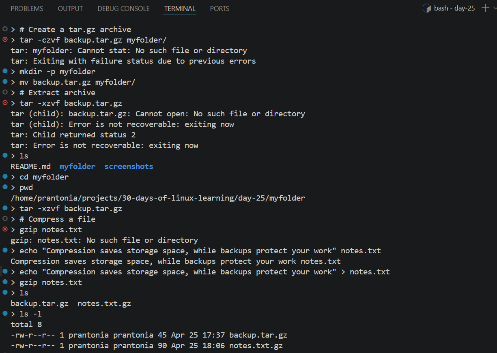
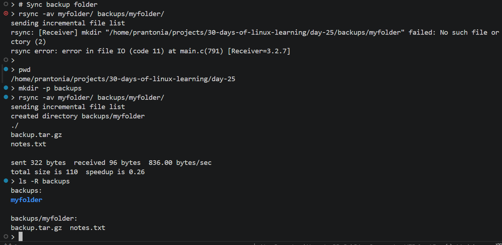
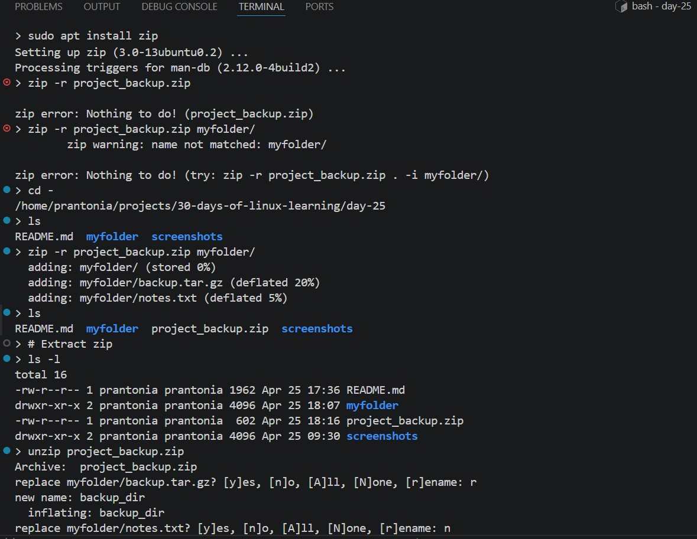

# Day 25 - Archiving, Compression and Backup

## Objective

To learn how to package files, compress data to save space, and create simple backups using common Linux tools.

---

## What I Learned

- Why compression matters for logs, backups, and datasets.
- Difference between archiving and compressing.
- `tar` combines many files/folders into a single archive file
- Common `tar` flags: `-c` create, `-x` extract, `-v` verbose, `-f` filename
- `gzip` compresses files into `.gz` format
- `gunzip` restores `.gz` files
- `zip` and `unzip` are cross-platform archive tools
- `rsync` copies files efficiently and is great for backups
- `cp -r` can make simple folder backups
- Naming backups with dates improves organization
- Verifying backup contents is important before deleting originals

---

## What I Built / Practiced

- Created a `.tar.gz` archive of a practice directory
- Extracted an archive into a restore folder
- Compressed and decompressed a text file using gzip
- Created a `.zip` backup of project notes
- Used `rsync` to copy files into a backup folder
- Generated a dated backup directory for practice files

---

## Challenges Faced

- Forgetting archive flags in tar commands.
- Extracting files into the wrong location. 

---

## Key Takeaways

- Compressed files are everywhere in data work.
- Knowing `tar` and `gzip` saves time immediately
- `rsync` is far more efficient than `cp` for large backups, it only transfers changes
- Always test a restore before relying on a backup, a backup you can't restore is not a backup

---

## Resources

- [The Linux Command Line: Chapter 18 – Archiving and Backup](https://linuxcommand.org/tlcl.php)
- [How to Use rsync - DigitalOcean](https://www.digitalocean.com/community/tutorials/how-to-use-rsync-to-sync-local-and-remote-directories)
- [How to Create a Backup Script for Important Files in Linux - TecMint](https://www.tecmint.com/linux-file-backup-script/)
- `man` pages: `man tar`, `man rsync`

---

## Output

*Figure 1: Created a tar.gz archive, compressed a text file with gzip, and verified generated backup files*

---

*Figure 2: Used `rsync` to sync myfolder into a backup directory after creating the destination path*

---

*Figure 3: Created a ZIP backup archive and extracted it with unzip*

---
