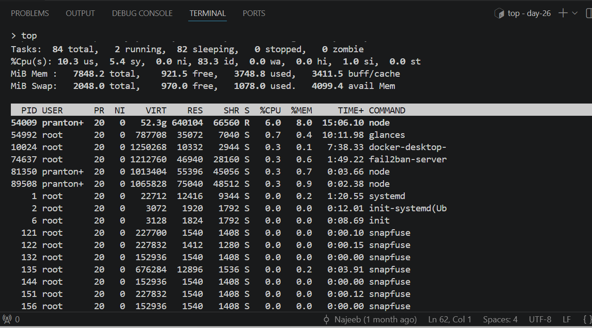
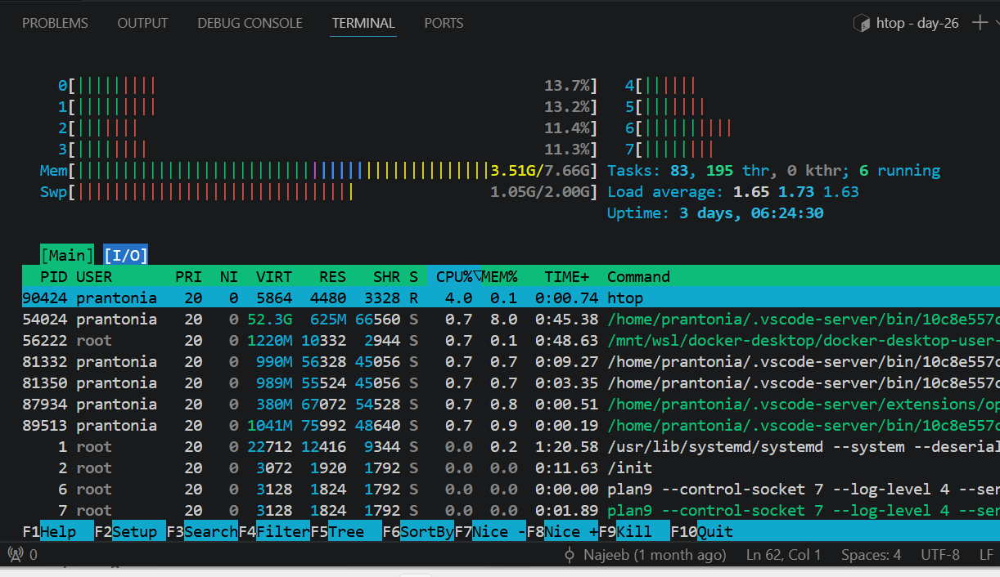
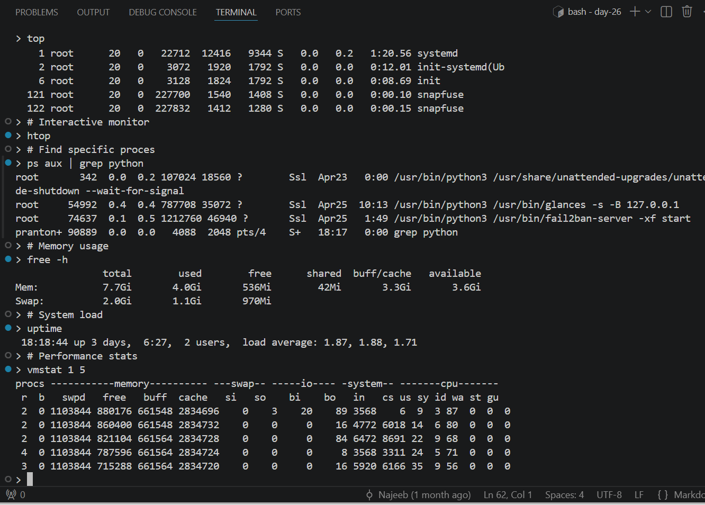

# Day 26 - Linux Processes and System Performance

## Objective

To understand how Linux manages running processes, monitor system performance in real time, and control resource usage using built-in process and performance tools.

---

## What I Learned

- A process is a running instance of a program
- Every process has a PID (Process ID)
- `ps` displays running processes and process details
- `top` provides a live view of CPU, memory, and processes
- `htop` is an improved interactive version of top
- `kill` sends signals to stop or manage processes
- `pkill` kills processes by name
- `nice` and `renice` adjust process priority
- `free -h` shows memory and swap usage
- `uptime` displays system uptime and load average
- `vmstat` shows CPU, memory, and I/O statistics

---

## What I Built / Practiced

- Listed active processes using `ps aux`
- Used `top` to monitor CPU and memory usage in real time
- Installed and used `htop` for interactive monitoring
- Identified a process PID and terminated it with `kill`
- Used `pkill` to stop a process by name
- Checked memory usage with `free -h`
- Viewed load averages with `uptime`
- Ran `vmstat` to inspect performance metrics

---

## Challenges Faced

- Understanding the difference between CPU usage and load average
- Identifying safe vs unsafe processes to terminate
- Remembering common kill signals like SIGTERM and SIGKILL
- Reading many columns in `ps` and `top` outputs

---

## Key Takeaways

- Processes are central to Linux system operations
- `top` and `htop` are essential for live troubleshooting
- `ps` helps inspect background or hidden tasks
- Load averages show system demand over time
- Monitoring performance helps detect bottlenecks early
- `htop` gives you an immediate, clear picture of what the system is doing
- Always try `kill -15` (SIGTERM) before `kill -9` (SIGKILL), SIGKILL gives the process no chance to clean up, which can leave temporary files, locks, or incomplete writes behind
- Load average alone does not tell the full story, cross-reference with `vmstat` and `iostat` to know whether the bottleneck is CPU, memory, or disk

---

## Resources

- [The Linux Command Line: Chapter 10 – Processes](https://linuxcommand.org/tlcl.php)
- [How to Kill a Process in Linux - Linuxize.com](https://linuxize.com/post/how-to-kill-a-process-in-linux/)
- [What is Load Average in Linux? - DigitalOcean](https://www.digitalocean.com/community/tutorials/load-average-in-linux)
- `man` pages: `man ps`, `man top`, `man kill`, `man nice`, `man vmstat`, `man iostat` - all accessible directly in the terminal

---

## Output

*Figure 1: Using `top` to view live CPU, memory, and running processes in real time*

---

*Figure 2: Using `htop` for an interactive system performance dashboard and process manager*

---

*Figure 3: Practicing process monitoring with `ps`, `grep`, `free -h`, `uptime`, and `vmstat`*

---
