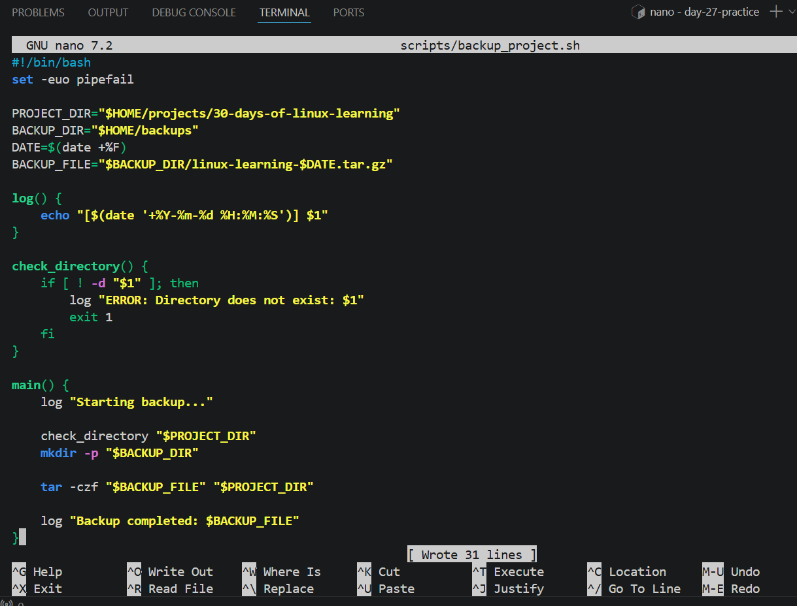
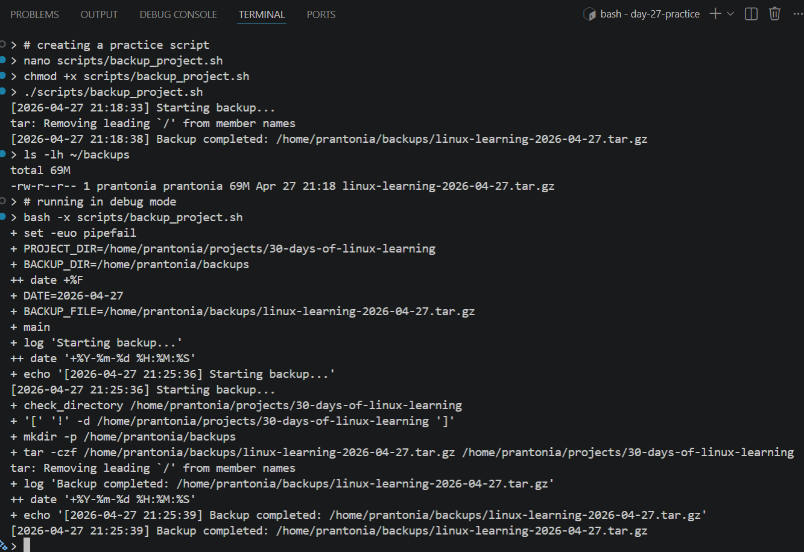

# Day 27 - Advanced Bash Scripting

## Objective

To learn more advanced Bash scripting concepts for building safer, more reusable, and more reliable automation scripts

---

## What I Learned

- Arrays: `arr`=(a b c); `${arr[0]}`; `${arr[@]}` for all elements; `${#arr[@]}` for length
- String manipulation: `${#var}` length, `${var:0:5}` substring, `${var//old/new}` replace
- Error handling ( improves script reliability): 
    - `set -e` makes a script stop when a command fails
    - `set -u` treats unset variables as errors
    - `set -o` pipefail helps detect failures inside pipelines
- trap: catch signals and clean up on exit
- Debugging: `bash -x script.sh` (trace mode), `set -x` to enable in script
- Here documents (heredoc): `cat <<EOF ... EOF` for multi-line strings
- Regular expressions in bash with `=~` operator
- Functions help organize scripts into reusable blocks
- Script arguments like `$1`, `$2`, `$@`, and `$#` make scripts dynamic
- `getopts` can be used to handle command-line options
- Exit codes help determine whether a command succeeded or failed
- Logging makes scripts easier to debug and monitor

---

## What I Built / Practiced

- Wrote scripts using strict mode: `set -euo pipefail`
- Created reusable Bash functions
- Added input validation for script arguments
- Used exit codes to handle success and failure
- Added logging messages with timestamps
- Built a script that accepts options and arguments
- Practiced debugging scripts using `bash -x`

---

## Challenges Faced

- Understanding how `set -euo pipefail` changes script behavior
- Remembering how positional arguments work
- Handling missing arguments safely
- Debugging errors caused by unset variables or failed commands
- Writing scripts that fail clearly instead of silently

---

## Key Takeaways

- Advanced Bash scripting is about writing safer and more maintainable scripts
- Functions reduce repetition and improve organization
- Arguments and options make scripts flexible
- Logging and error handling are important for real automation workflows
- `set -euo` pipefail at the top of every serious script, it catches most common bugs
- `bash -x` is a powerful debugging tool, to be used when a script behaves unexpectedly

---

## Resources

- [Advanced Bash Scripting Guide](https://tldp.org/LDP/abs/html/)
- [Bash Strict Mode - Aaron Maxwell](http://www.redsymbol.net/articles/unofficial-bash-strict-mode/)
- [ShellCheck](https://www.shellcheck.net/)
- `man bash`, `help set`, `help getopts`, `help trap`, `bash --help`

---

## Output

*Figure 1: Writing an advanced Bash backup script with functions, logging, and strict mode*

---

*Figure 2: Running and debugging the script using `bash -x` to trace execution step-by-step*

---
