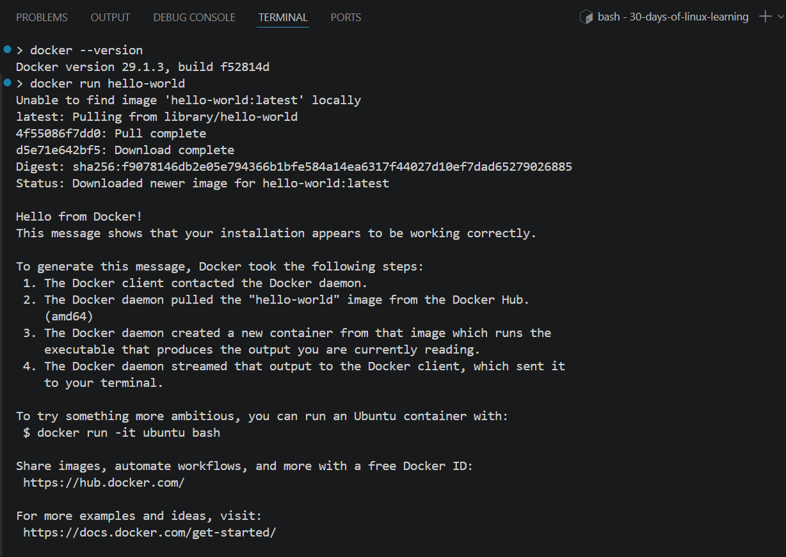
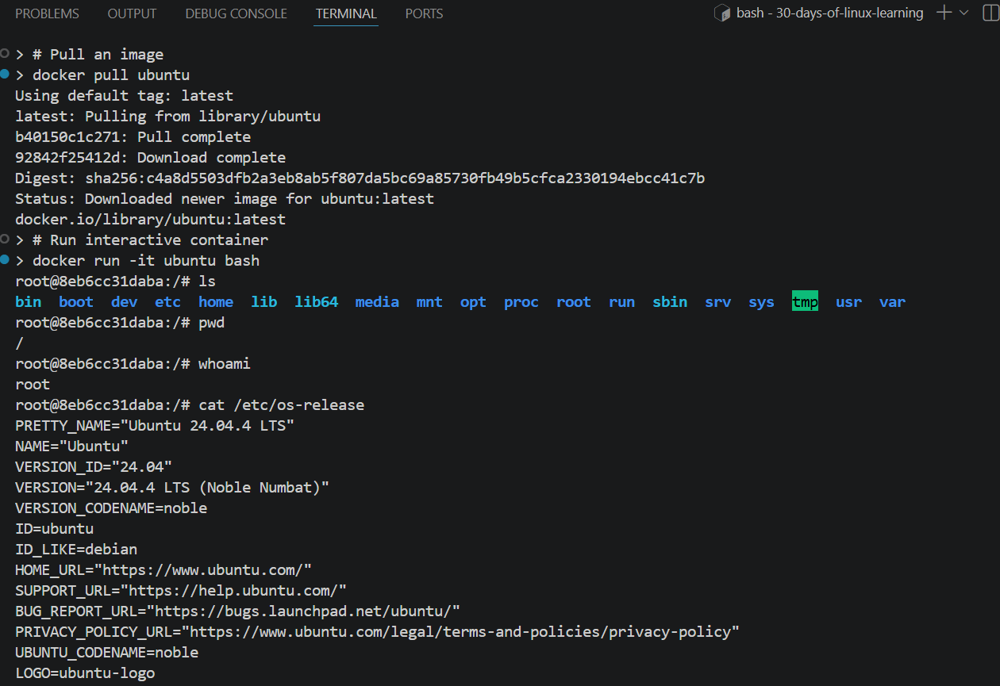
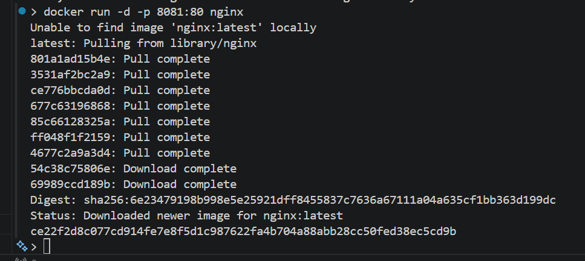
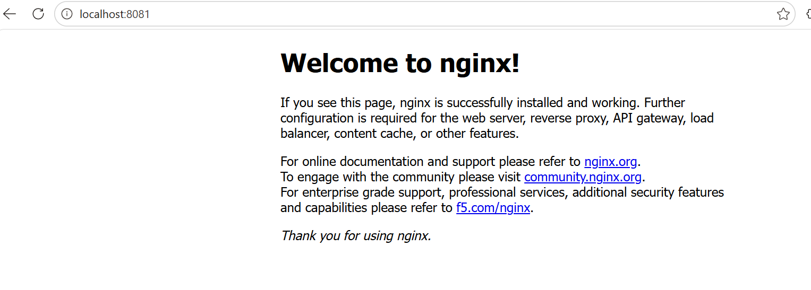
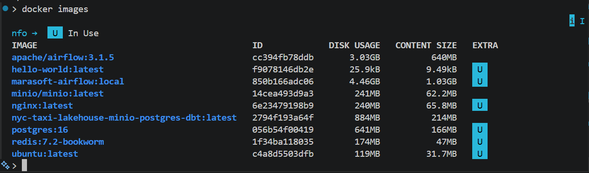

# Day 28 - Introduction to Containers (Docker on Linux)

## Objective

To understand containerisation concepts, learn how Docker works natively on Linux, and practise running, managing, and building containers from the command line.

---

## What I Learned

- **Containers vs Virtual Machines**: VMs virtualise hardware and run a full OS; Containers share the host Linux kernel and only isolate the process environment, making them significantly lighter and faster to start
- **Docker on Linux is native**: containers are built on Linux kernel features, **namespaces** (isolate processes, networking, file systems) and **cgroups** (limit CPU, memory, disk usage). 
- **Docker architecture**: the Docker daemon (`dockerd`) runs in the background and manages containers; the Docker CLI (`docker`) is what you interact with; images are read-only templates; containers are running instances of images; Docker Hub is the default public registry
- `docker pull <image>` downloads an image from Docker Hub
- `docker run -d -p 8081:80 nginx` runs a container in detached mode, map host port 8081 to container port 80
- `docker ps` lists running containers; `docker ps -a` lists all including stopped ones
- `docker logs <name>` views stdout/stderr output from a container
- `docker exec -it <name> bash` opens an interactive shell inside a running container
- `docker stop <name>` and `docker rm <name>` stops and removes a container
- `docker images` and `docker rmi <image>` list and remove local images
- **Dockerfile**: a text file that defines how to build a custom image. `FROM`, `COPY`, `RUN`, `CMD` are the core instructions
- **Volumes**: containers are ephemeral, any data written inside is lost when the container is removed. Volumes (`-v /host/path:/container/path`) persist data on the host
- **docker-compose**: defines and runs multi-container applications using a `docker-compose.yml` file

---

## What I Built / Practiced

- Installed Docker and verified installation
- Ran my first container using hello-world
- Pulled images from Docker Hub
- Ran an interactive Ubuntu container
- Listed running and stopped containers
- Ran an Nginx container and accessed it via browser
- Stopped and removed containers

---

## Challenges Faced

- Got "Permission denied" when running `docker` without `sudo`, fixed by adding my user to the docker group with `sudo usermod -aG docker $USER` then logging out and back in for the group change to take effect
- Understanding the difference between an **image** (the blueprint, read-only) and a **container** (the running instance). Multiple containers can be started from the same image simultaneously

---

## Key Takeaways

- Containers are isolated Linux processes, not full operating systems
- Docker simplifies application deployment and environment setup
- Understanding containers builds on core Linux concepts like processes and networking
- Containers are widely used in DevOps and cloud environments
- Docker on Linux runs containers without any virtualisation layer, this is why containers start in milliseconds and have near-zero overhead compared to VMs
- Containers are ephemeral by design, always use volumes for any data you need to persist beyond the container's lifetime
- `docker exec -it <name> bash` is one of the most useful commands for debugging a running container, it lets you inspect the environment, check files, and run commands as if you were inside the system
- As a data engineer, Docker is not just a tool to know, it is the standard way to package and deploy pipelines, Airflow DAGs, and data applications in production environments. Understanding it at the Linux level gives you an edge when things go wrong in containerised deployments

---

## Resources

- [Docker Documentation](https://docs.docker.com/)
- [Docker Run, Attach, and Exec: How They Work Under the Hood (and Why It Matters) - Ivan Velichko](https://labs.iximiuz.com/tutorials/docker-run-vs-attach-vs-exec)
- [An Introduction to Docker and Containers for Beginners - freeCodeCamp](https://www.freecodecamp.org/news/an-introduction-to-docker-and-containers-for-beginners/)
- [Interactive: Play with Docker (browser-based Docker environment)](https://labs.play-with-docker.com)

---

## Output

*Figure 1: Docker installation verified using `hello-world` container*

---

*Figure 2: Pulled Ubuntu image and launched an interactive container session*

---

*Figure 3: Pulled and ran Nginx container mapped to port 8081*

---

*Figure 4: Nginx web server successfully running on `localhost:8081`*

---

*Figure 5: Listing locally available Docker images with `docker images`*

---
