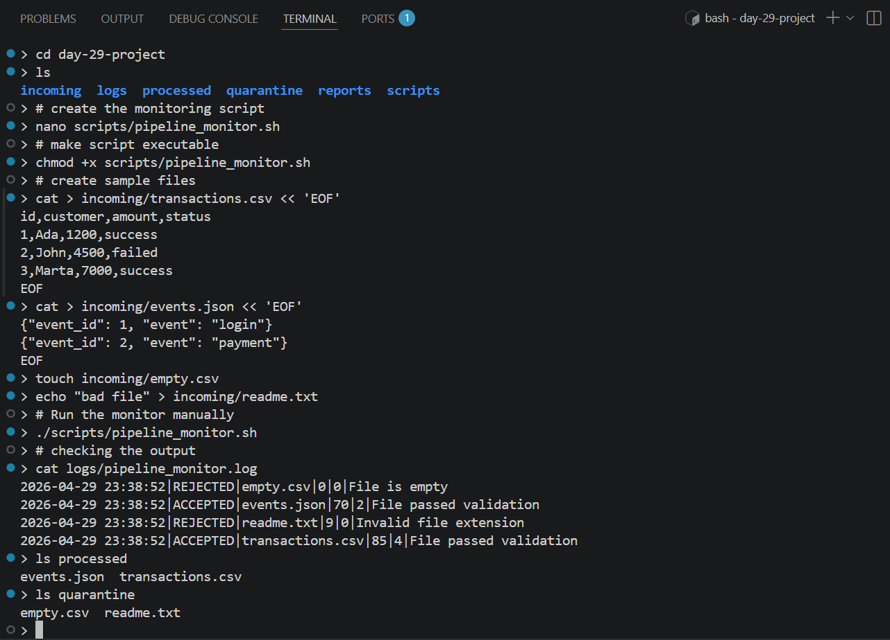
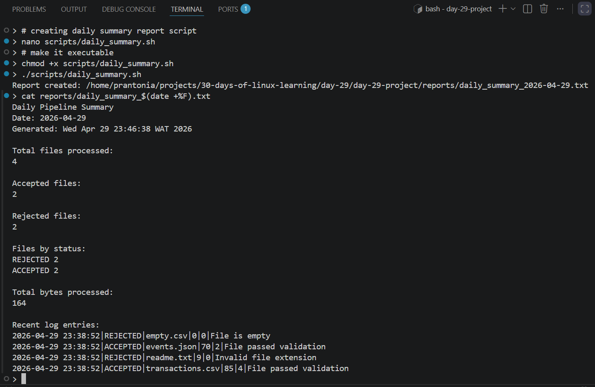

# Day 29 - Building a Linux-Powered Data Pipeline Monitor

## Objective

To build a **Linux-based data pipeline monitor** that automatically detects incoming data files, validates them, logs metadata, and generates daily summary reports using core Linux tools and Bash scripting.

---

## Project Overview

This project simulates a **real-world data ingestion layer** where files arrive into a directory and must be:

* validated
* tracked
* processed
* monitored

It demonstrates how Linux can be used as a **lightweight data engineering platform** without external frameworks.

---

## Features

* Monitors an incoming directory for new files
* Validates file integrity (readable, non-empty, correct format)
* Extracts metadata (filename, size, row count, timestamp)
* Routes files to:

  * `processed/` (valid files)
  * `quarantine/` (invalid files)
* Logs all events in a structured format
* Generates daily summary reports
* Fully automated using cron

---

## Project Structure

```text
.
├── README.md
└── day-29-project
    ├── .gitignore
    ├── backups
    │   └── .gitkeep
    ├── incoming
    │   └── .gitkeep
    ├── logs
    │   ├── .gitkeep
    │   └── pipeline_monitor.log
    ├── processed
    │   ├── .gitkeep
    │   ├── events.json
    │   └── transactions.csv
    ├── quarantine
    │   ├── .gitkeep
    │   ├── empty.csv
    │   └── readme.txt
    ├── reports
    │   ├── .gitkeep
    │   └── daily_summary_2026-04-29.txt
    └── scripts
        ├── daily_summary.sh
        └── pipeline_monitor.sh

```

---

## How It Works

### 1. File Ingestion

Files are dropped into:

```bash
incoming/
```

Supported formats:

* `.csv`
* `.json`

---

### 2. Validation Rules

Each file is checked for:

* Read permission
* Non-empty content
* Valid extension

Invalid files are moved to:

```bash
quarantine/
```

---

### 3. Metadata Extraction

For each valid file:

* Filename
* File size (bytes)
* Row count
* Timestamp

---

### 4. Logging

All events are stored in:

```bash
logs/pipeline_monitor.log
```

### Log Format

```text
timestamp | status | filename | size | rows | message
```

### Example

```text
2026-04-29 10:15:02|ACCEPTED|transactions.csv|234|6|File passed validation
2026-04-29 10:16:11|REJECTED|empty.csv|0|0|File is empty
```

---

### 5. Processing

* Valid files → `processed/`
* Invalid files → `quarantine/`

---

### 6. Daily Summary Report

Generated automatically:

```bash
reports/daily_summary_YYYY-MM-DD.txt
```

### Includes:

* Total files processed
* Accepted vs rejected counts
* Total data volume
* Status breakdown
* Recent activity

---

## Setup and Usage

### 1. Make scripts executable

```bash
chmod +x scripts/*.sh
```

---

### 2. Run manually

```bash
./scripts/pipeline_monitor.sh
./scripts/daily_summary.sh
```

---

### 3. Automate with cron

```bash
crontab -e
```

Add:

```bash
*/5 * * * * /home/prantonia/projects/30-days-of-linux-learning/day-29/day-29-project/scripts/pipeline_monitor.sh
59 23 * * * /home/prantonia/projects/30-days-of-linux-learning/day-29/day-29-project/scripts/daily_summary.sh
```

---

## Log Analysis (Real Linux Skills)

### View accepted files

```bash
grep "|ACCEPTED|" logs/pipeline_monitor.log
```

### Count rejected files

```bash
grep -c "|REJECTED|" logs/pipeline_monitor.log
```

### Group by status

```bash
awk -F'|' '{count[$2]++} END {for (s in count) print s, count[s]}' logs/pipeline_monitor.log
```

### Total data processed

```bash
awk -F'|' '{sum += $4} END {print sum}' logs/pipeline_monitor.log
```

---

## Backup Strategy (Optional Extension)

You can archive processed data:

```bash
tar -czf backups/backup-$(date +%F).tar.gz processed/ logs/ reports/
```

---

## Tools and Concepts Used

* Bash scripting (`set -euo pipefail`)
* File system operations (`mv`, `stat`, `wc`)
* Text processing (`awk`, `grep`, `cut`)
* Logging best practices
* Cron scheduling
* Linux permissions and validation
* Data pipeline fundamentals

---

## Key Takeaways

* Linux can act as a **data processing engine**
* Bash is powerful for **ETL-style workflows**
* Structured logs enable **observability**
* Automation (cron) is critical for production systems
* File validation is essential in real pipelines

---

## Note

This project represents a **practical bridge between Linux and Data Engineering**, showing how core system tools can be used to build automated, observable, and reliable data workflows.

---

## Output


*Figure 1: Pipeline monitor processing files, valid files accepted, invalid ones quarantined*

---


*Figure 2: Daily summary report generated with file stats and recent log activity*

---
