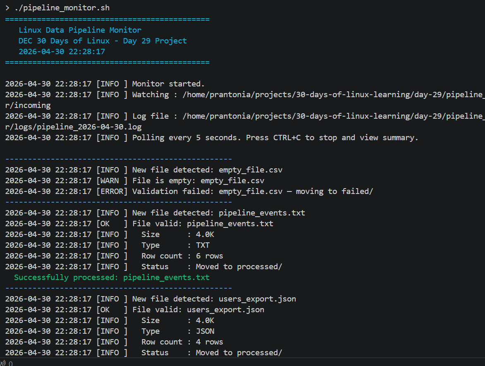
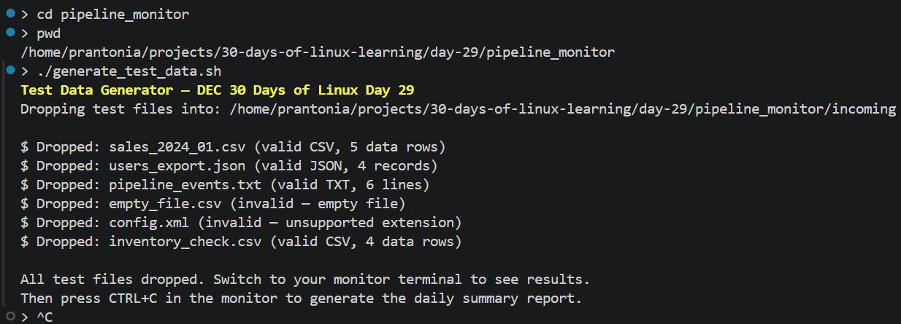
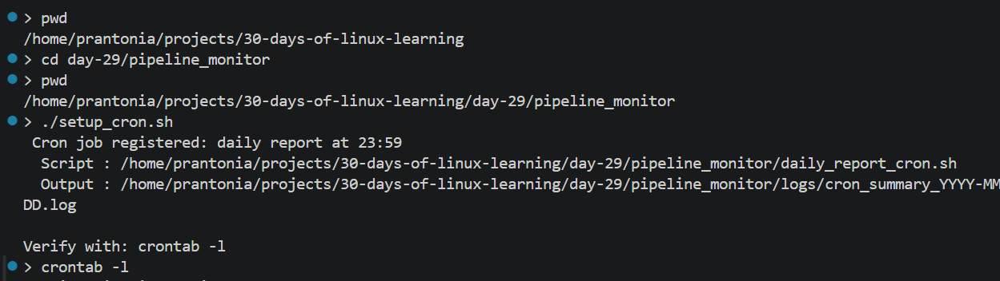

# Day 29 - Linux Data Pipeline File Monitor (Project)

## Objective

To apply the Linux skills learned across 28 days by building a real, intermediate-level data engineering project: an automated file monitoring and validation system that watches a directory for incoming data files, validates them, logs metadata, and generates a daily summary report, all in pure Bash.

---

## What I Learned

- How to build a **production-quality Bash script** that combines: functions, arrays, error handling (`set -euo pipefail`), `trap` for cleanup, and `find` for file discovery
- How to use `find -maxdepth 1 -type f -print0` with `while read -r -d ''` to safely iterate over files — handling filenames with spaces correctly
- How to use `wc -l`, `du -sh`, `grep -c`, and `awk` together to extract structured metadata from different file types (CSV, JSON, TXT)
- How to write a **polling loop** - a `while true` loop with `sleep` that continuously scans a directory for new files without using `inotify` or any external dependency
- How `trap cleanup INT TERM` works - intercepting CTRL+C and TERM signals to run a cleanup function before the script exits, ensuring the summary report always prints
- How to write **structured log entries** in a consistent format that can be queried later with `grep` and `awk`
- How to use **ANSI colour codes** (`\033[0;32m` etc.) to make terminal output readable at a glance
- How to schedule a companion cron job that generates a daily summary automatically at 23:59

---

## What I Built / Practiced

Built a three-script project inside `~/pipeline_monitor/`:

```
~/pipeline_monitor/
├── pipeline_monitor.sh      # Main monitor script
├── generate_test_data.sh    # Test file generator to simulate incoming data
├── setup_cron.sh            # Registers the daily summary cron job
├── incoming/                # Drop zone — monitor watches this directory
├── processed/               # Successfully validated files moved here
├── failed/                  # Files that failed validation moved here
├── logs/                    # Daily log files (pipeline_YYYY-MM-DD.log)
└── reports/                 # Daily summary reports (summary_YYYY-MM-DD.txt)
```

**How to run the project:**

```bash
# 1. Create the project directory
mkdir -p ~/pipeline_monitor
cd ~/pipeline_monitor

# 2. Make all scripts executable
chmod +x pipeline_monitor.sh generate_test_data.sh setup_cron.sh

# 3. Terminal 1 - start the monitor
./pipeline_monitor.sh

# 4. Terminal 2 - drop test files into the watch directory
./generate_test_data.sh

# 5. Watch Terminal 1 process each file in real time
# Press CTRL+C in Terminal 1 to stop and generate the summary report

# 6. Optional - Register the daily cron job
./setup_cron.sh
crontab -l  # verify it was registered
```

---

## Challenges Faced

- **Safely iterating files with spaces in names**: a basic `for f in $WATCH_DIR/*` breaks when filenames contain spaces. Fixed by using `find -print0` piped into `while IFS= read -r -d ''` - the null delimiter approach handles any filename correctly
- **`set -e` conflicting with `grep -c`**: `grep -c` returns exit code `1` when it finds zero matches, which `set -euo pipefail` treats as a script failure. Fixed by appending `|| echo "0"` to grep calls that are expected to sometimes return no results
- **`trap` and the polling loop**: getting `trap cleanup INT TERM` to correctly intercept CTRL+C inside a `while true; do ... sleep; done` loop - the trap fires when sleep is interrupted, which is the expected behaviour

---

## Key Takeaways

- **This project is reflects real data engineering**: watching for files, validating schema/structure, logging metadata, moving files between stages (incoming → processed/failed), and reporting 
- Every skill from the past 28 days showed up in this project
- A script with `set -euo pipefail` + `trap` + structured logging is not just a practice exercise, it is the standard expected in production bash scripts at any serious data team

---

## Output


*Figure 1: Pipeline monitor running - files validated, accepted, and rejected in real time*

---


*Figure 2: Test data generator dropping sample files into the incoming directory*

---


*Figure 3: Cron job configured for automated daily pipeline summary reporting*

---
